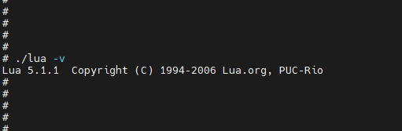

# lua_5.1.1 集成到应用hap

本库是在RK3568开发板上基于OpenHarmony3.2 Release版本的镜像验证的，如果是从未使用过RK3568，可以先查看[润和RK3568开发板标准系统快速上手](https://gitee.com/openharmony-sig/knowledge_demo_temp/tree/master/docs/rk3568_helloworld)。

## 开发环境

- [开发环境准备](../../../docs/hap_integrate_environment.md)

## 编译三方库

- 下载本仓库

  ```shell
  git clone https://gitee.com/openharmony-sig/tpc_c_cplusplus.git --depth=1
  ```

- 三方库目录结构

  ```shell
  tpc_c_cplusplus/community/lua_5.1.1        #三方库lua_5.1.1的目录结构如下
  ├── docs                                   #三方库相关文档的文件夹
  ├── HPKBUILD                               #构建脚本
  ├── HPKCHECK                               #测试脚本
  ├── SHA512SUM                              #三方库校验文件
  ├── README.OpenSource                      #说明三方库源码的下载地址，版本，license等信息
  ├── README_zh.md                           #三方库简介
  ```

- 在lycium目录下编译三方库

  `community` 目录下的库默认作为 `thirdparty` 的依赖隐式编译；如需单独编译，可将本目录复制到 `thirdparty/` 后执行 `./build.sh lua_5.1.1`。

  编译环境的搭建参考[准备三方库构建环境](../../../lycium/README.md#1编译环境准备)

  ```shell
  cd lycium
  # 方式一：复制到 thirdparty 后显式编译
  cp -r ../community/lua_5.1.1 ../thirdparty/
  ./build.sh lua_5.1.1
  # 方式二：在 thirdparty 某库的 depends 中声明 lua_5.1.1 后随依赖链编译
  ```

- 三方库头文件及生成的库

  在lycium目录下会生成usr目录，该目录下存在已编译完成的32位和64位三方库

  ```shell
  lua_5.1.1/arm64-v8a   lua_5.1.1/armeabi-v7a
  ```

- [测试三方库](#测试三方库)

## 应用中使用三方库

lua最终生成的是lua可执行文件，无需引入测试编译，引用原生库的测试逻辑即可。

## 测试三方库

- 将lua推送到开发板 ,具体步骤如下：

  ```sh
  hdc_std.exe file send lua /data/        ## 将测试资源推送到板子
  hdc_std.exe shell                             ## 进入设备系统
  cd /data
  chmod +x lua                          ## 设置lua可执行权限
  ./lua -v
  ```

可看到其执行结果，如下图所示:
&nbsp;

## 参考资料

- [润和RK3568开发板标准系统快速上手](https://gitee.com/openharmony-sig/knowledge_demo_temp/tree/master/docs/rk3568_helloworld)
- [OpenHarmony三方库地址](https://gitee.com/openharmony-tpc)
- [OpenHarmony知识体系](https://gitee.com/openharmony-sig/knowledge)
- [通过DevEco Studio开发一个NAPI工程](https://gitee.com/openharmony-sig/knowledge_demo_temp/blob/master/docs/napi_study/docs/hello_napi.md)
