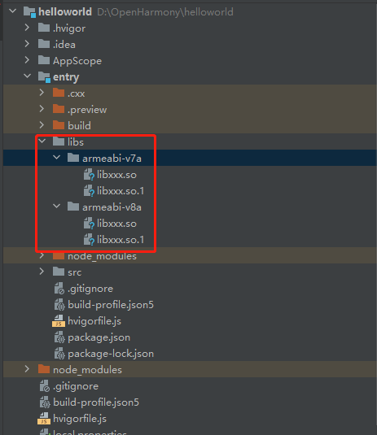
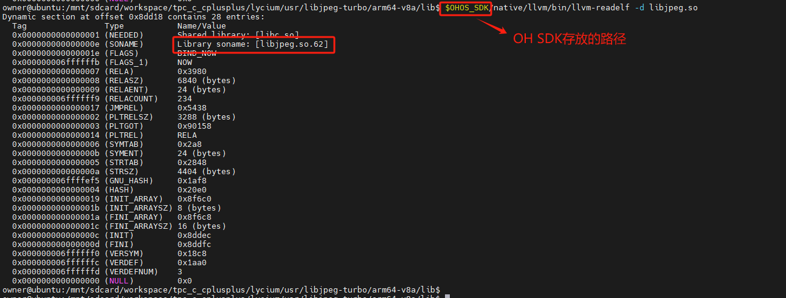
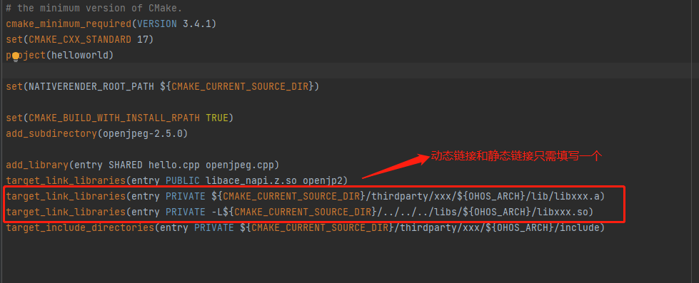

# 应用工程使用三方库二进制文件

1. 将三方库生成的二进制文件拷贝到应用工程目录

   为了更好的管理应用集成的三方库，在应用工程的cpp目录新建一个thirdparty目录，将生成的二进制文件以及头文件拷贝到该目录下，如下图所示,xxx代表的是三方库名称，xxx文件夹下包含了arm架构以后aarch64架构2种方式生成的二进制文件，每种架构目录下包含了该库的头文件(include)以及二进制文件(lib)：

   

   如果该三方库二进制文件为so文件，还需要将so文件拷贝到工程目录的`entry/libs/${OHOS_ARCH}/`目录下,如下图:

   

   **动态库引用事项注意: 1、应用在引用动态库的时候是通过soname来查找的，所以我们需要将名字为soname的库文件拷贝到entry/libs/${OHOS_ARCH}/目录下(soname查看方法：` $OHOS_SDK/native/llvm/bin/llvm-readelf -d libxxx.so`)。**

   &nbsp;

   **2、 要正确的拷贝SO文件，如下图所示：** <br>
    原库大小：<br>
    

    正确拷贝so文件后so文件大小应该与原库实体文件大小一致，如下图所示：(拷贝方法：不通过压缩直接将so文件拷贝到windows或将so文件压缩成.zip格式拷贝到windwos) <br>
    

    如果将so文件以tar,gz,7z,bzip2等压缩方式拷贝到windwos后在解压，其文件是实体库的软连接，其大小和实体库大小不一致，文件也不能正常使用：<br>
    

2. 配置对应链接

   配置链接只需要在cpp目录的CMakeLists.txt文件中添加对应`target_link_libraries`即可：
   - 配置静态库链接

    ```cmake
    target_link_libraries(entry PRIVATE ${CMAKE_CURRENT_SOURCE_DIR}/thirdparty/xxx/${OHOS_ARCH}/lib/libxxx.a)
    ```

   - 配置动态库链接

    ```cmake
    target_link_libraries(entry PRIVATE ${CMAKE_CURRENT_SOURCE_DIR}/thirdparty/xxx/${OHOS_ARCH}/lib/libxxx.so)
    ```

    

3. 配置头文件路径

   配置链接只需要在cpp目录的CMakeLists.txt文件中添加对应`target_include_directories`

    ```cmake
    target_include_directories(entry PRIVATE ${CMAKE_CURRENT_SOURCE_DIR}/thirdparty/xxx/${OHOS_ARCH}/include)
    ```

4. 编写NAPI接口

   配置完三方库的链接和头文件路径后，可以根据各自的业务逻辑调用三方库对应的接口完成NAPI接口的编写，NAPI接口开发可以参照文档[NAPI学习](docs/thirdparty_knowledge.md###北向应用中使用).

5. 编译构建

   请参考文档[DevEco Studio编译构建指南](https://developer.harmonyos.com/cn/docs/documentation/doc-guides-V3/build_overview-0000001055075201-V3?catalogVersion=V3)