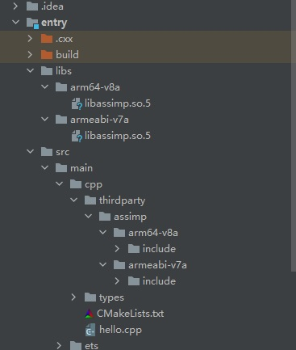

# LuaXML集成到应用hap
本库是在RK3568开发板上基于OpenHarmony3.2 Release版本的镜像验证的，如果是从未使用过RK3568，可以先查看[润和RK3568开发板标准系统快速上手](https://gitee.com/openharmony-sig/knowledge_demo_temp/tree/master/docs/rk3568_helloworld)。
## 开发环境
- [开发环境准备](../../../docs/hap_integrate_environment.md)
## 编译三方库
- 下载本仓库
  ```
  git clone https://gitee.com/openharmony-sig/tpc_c_cplusplus.git --depth=1
  ```
- 三方库目录结构
  ```
  tpc_c_cplusplus/thirdparty/LuaXML     #三方库LuaXML的目录结构如下
  ├── docs                              #三方库相关文档的文件夹
  ├── HPKBUILD                          #构建脚本
  ├── SHA512SUM                         #三方库校验文件
  ├── OAT.xml              			  #OAT文件
  ├── README.OpenSource                 #说明三方库源码的下载地址，版本，license等信息
  ├── README_zh.md   
  ```
  
- 将LuaXML拷贝至lycium/main目录下
  ```
  cd tpc_c_cplusplus
  mkdir -p lycium/main
  cp thirdparty/LuaJIT lycium/main -rf
  cp thirdparty/LuaXML lycium/main -rf
  ```
- 在lycium目录下编译三方库
  编译环境的搭建参考[准备三方库构建环境](../../../lycium/README.md#编译环境准备)
  
  ```
  cd lycium
  ./build.sh LuaXML
  ```
- 三方库头文件及生成的库
  在lycium目录下会生成usr目录，该目录下存在已编译完成的32位和64位三方库
  ```
  LuaXML/armeabi-v7a LuaXML/arm64-v8a
  ```
  
- [测试三方库](#测试三方库)

## 应用中使用三方库

- 在IDE的cpp目录下新增thirdparty目录，将编译生成的库头文件拷贝到该目录下, 如下图所示
&nbsp;
- 由于只编译了arm以及arm64so库，IDE默认会编译x86版本，需要指定ABI进行编译，如下图所示
&nbsp;
- 在最外层（cpp目录下）CMakeLists.txt中添加如下语句
  ```
  #将三方库加入工程中
  target_link_libraries(entry PRIVATE -L${CMAKE_CURRENT_SOURCE_DIR}/../../../libs/${OHOS_ARCH}/LuaXML_lib.so)
  #将三方库的头文件加入工程中
  target_include_directories(entry PRIVATE ${CMAKE_CURRENT_SOURCE_DIR}/thirdparty/LuaXML/${OHOS_ARCH}/include)
  ```
  
## 测试三方库
三方库的测试使用原库自带的测试用例来做测试，[准备三方库测试环境](../../../tools/README.md#ci环境准备)

- 进入到构建目录,执行如下命令（arm64-v8a-build为构建64位的目录，armeabi-v7a-build为构建32位的目录）
注意:以下为64位命令，如需测试32位，请将arm64-v8a替换为armeabi-v7a。
```
# 使用动态库链接，由于lua的原因LD_LIBRARY_PATH无效，需要将libluajit-5.1.so.2.1.0拷贝到系统默认so查找路径
mount -o remount,rw /
mkdir -p /usr/local/lib
export ROOT_PATH=/data/local/tmp/lycium   #编译工具所在的目录, 需要按实际情况修改
cp ${ROOT_PATH}/usr/LuaJIT/arm64-v8a/lib/libluajit-5.1.so.2.1.0 /usr/local/lib/libluajit-5.1.so.2
cd ${ROOT_PATH}/main/LuaXML/LuaXML-7cd4a7ab5db85222edb4c955d53e5674afd170b6-arm64-v8a-build
export LUAJIT_PATH=$ROOT_PATH/usr/LuaJIT/arm64-v8a/bin/luajit-2.1.0-beta3
make test LUA=${LUAJIT_PATH} VERBOSE=1
mount -o remount,ro /
export LUAJIT_PATH=
export ROOT_PATH=
```

测试用例运行结果如下：

&nbsp;

## 参考资料
- [润和RK3568开发板标准系统快速上手](https://gitee.com/openharmony-sig/knowledge_demo_temp/tree/master/docs/rk3568_helloworld)
- [OpenHarmony三方库地址](https://gitee.com/openharmony-tpc)
- [OpenHarmony知识体系](https://gitee.com/openharmony-sig/knowledge)
- [通过DevEco Studio开发一个NAPI工程](https://gitee.com/openharmony-sig/knowledge_demo_temp/blob/master/docs/napi_study/docs/hello_napi.md)
