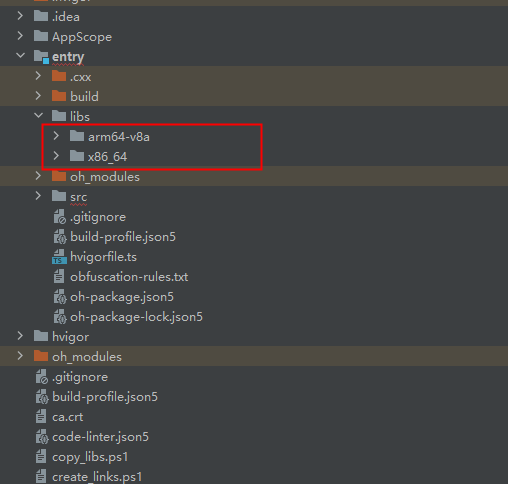
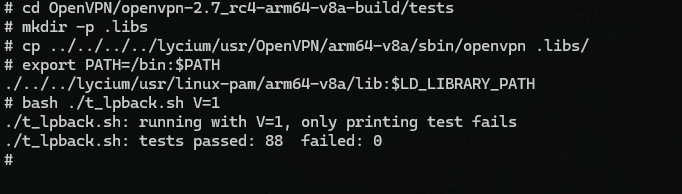

# openssl集成到应用hap
本库是在RK3568开发板上基于OpenHarmony3.2 Release版本的镜像验证的，如果是从未使用过RK3568，可以先查看[润和RK3568开发板标准系统快速上手](https://gitee.com/openharmony-sig/knowledge_demo_temp/tree/master/docs/rk3568_helloworld)。
## 开发环境
- [开发环境准备](../../../docs/hap_integrate_environment.md)
## 编译三方库
- 下载本仓库
  ```
  git clone https://gitee.com/openharmony-sig/tpc_c_cplusplus.git --depth=1
  ```
  
- 三方库目录结构
  ```
  tpc_c_cplusplus/thirdparty/OpenVPN  #三方库OpenVPN的目录结构如下
  ├── docs                              #三方库相关文档的文件夹
  ├── HPKBUILD                          #构建脚本
  ├── openvpn_oh_pkg.patch              #patch文件
  ├── README.OpenSource                 #说明三方库源码的下载地址，版本，license等信息
  ├── README_zh.md                      #三方库中文说明文档
  ├── SHA512SUM                         #三方库校验文件
  ```
  
- 在lycium目录下编译三方库
  编译环境的搭建参考[准备三方库构建环境](../../../lycium/README.md#1编译环境准备)
  ```
  cd lycium
  ./build.sh OpenVPN
  ```
  
- 三方库头文件及生成的库
  在lycium目录下会生成usr目录，该目录下存在已编译完成的32位和64位三方库
  
  ```
  OpenVPN/arm64-v8a   OpenVPN/armeabi-v7a
  ```
  
- [测试三方库](#测试三方库)

## 应用中使用三方库

- 在IDE的cpp目录下新增thirdparty目录，将编译生成的库和头文件以及依赖的文件拷贝到该目录下，如下图所示

&nbsp;

- 使用动态库还需将所有动态库静态库文件拷贝至entry/libs目录下，如下

&nbsp;

- 在最外层（cpp目录下）CMakeLists.txt中添加如下语句
  ```
  #将三方库加入工程中
  set(LIBS_DIR "${CMAKE_CURRENT_SOURCE_DIR}/../../../libs/${OHOS_ARCH}")
  target_link_libraries(entry PUBLIC ${LIBS_DIR}/libdrop_ambient.so)
  target_link_libraries(entry PUBLIC ${LIBS_DIR}/libcap-ng.so)
  target_link_libraries(entry PUBLIC ${LIBS_DIR}/libnl-3.so)
  target_link_libraries(entry PUBLIC ${LIBS_DIR}/libnl-cli-3.so)
  target_link_libraries(entry PUBLIC ${LIBS_DIR}/libnl-genl-3.so)
  target_link_libraries(entry PUBLIC ${LIBS_DIR}/libnl-idiag-3.so)
  target_link_libraries(entry PUBLIC ${LIBS_DIR}/libnl-nf-3.so)
  target_link_libraries(entry PUBLIC ${LIBS_DIR}/libnl-route-3.so)
  target_link_libraries(entry PUBLIC ${LIBS_DIR}/libnl-xfrm-3.so)
  target_link_libraries(entry PUBLIC ${LIBS_DIR}/libpam.so)
  target_link_libraries(entry PUBLIC ${LIBS_DIR}/libpam_misc.so)
  target_link_libraries(entry PUBLIC ${LIBS_DIR}/libpamc.so)
  target_link_libraries(entry PUBLIC ${LIBS_DIR}/liblzo2.a)
  target_link_libraries(entry PUBLIC ${LIBS_DIR}/libcrypto.a)
  target_link_libraries(entry PUBLIC ${LIBS_DIR}/libssl.a)
  target_link_libraries(entry PUBLIC ${LIBS_DIR}/libopenvpn.so) 
  
  #将三方库的头文件加入工程中
  target_include_directories(entry PRIVATE ${CMAKE_CURRENT_SOURCE_DIR}/thirdparty/openssl/${OHOS_ARCH}/include)
  target_include_directories(entry PRIVATE ${CMAKE_CURRENT_SOURCE_DIR}/thirdparty/OpenVPN/${OHOS_ARCH}/include/compat)
  target_include_directories(entry PRIVATE ${CMAKE_CURRENT_SOURCE_DIR}/thirdparty/OpenVPN/${OHOS_ARCH}/include/openvpn)
  target_include_directories(entry PRIVATE ${CMAKE_CURRENT_SOURCE_DIR}/thirdparty/OpenVPN/${OHOS_ARCH}/include/openvpnmsica)
  target_include_directories(entry PRIVATE ${CMAKE_CURRENT_SOURCE_DIR}/thirdparty/OpenVPN/${OHOS_ARCH}/include/openvpnserv)
  target_include_directories(entry PRIVATE ${CMAKE_CURRENT_SOURCE_DIR}/thirdparty/OpenVPN/${OHOS_ARCH}/include/plugins)
  target_include_directories(entry PRIVATE ${CMAKE_CURRENT_SOURCE_DIR}/thirdparty/OpenVPN/${OHOS_ARCH}/include/tapctl)
  ```

&nbsp;

## 测试三方库
三方库的测试使用原库自带的测试用例来做测试，[准备三方库测试环境](../../../lycium/README.md#3ci环境准备)

- 将编译生成的可执行文件及生成的动态库准备好

- 将准备好的文件推送到ohos设备，进入到构建目录执行如下命令运行测试用例（arm64-v8a-build为构建64位的目录，armeabi-v7a-build为构建32位的目录），以arm64-v8a为例：

  ```
  cd openvpn-2.7_rc4-arm64-v8a-build/tests
  mkdir -p .libs
  cp ../../../../lycium/usr/OpenVPN/arm64-v8a/sbin/openvpn .libs/
  export PATH=/bin:$PATH
  export LD_LIBRARY_PATH=../../../../lycium/usr/OpenVPN/arm64-v8a/lib:../../../../lycium/usr/libcap-ng/arm64-v8a/lib:../../../../lycium/usr/libnl/arm64-v8a/lib:../../../../lycium/usr/lzo/arm64-v8a/lib:../../../../lycium/usr/openssl/arm64-v8a/lib:../../../../lycium/usr/linux-pam/arm64-v8a/lib:$LD_LIBRARY_PATH
  bash ./t_lpback.sh V=1
  ```

 

## 参考资料

*   [OpenHarmony三方库地址](https://gitee.com/openharmony-tpc)
*   [OpenHarmony知识体系](https://gitee.com/openharmony-sig/knowledge)
*   [OpenVPN三方库地址](https://github.com/OpenVPN/openvpn)
