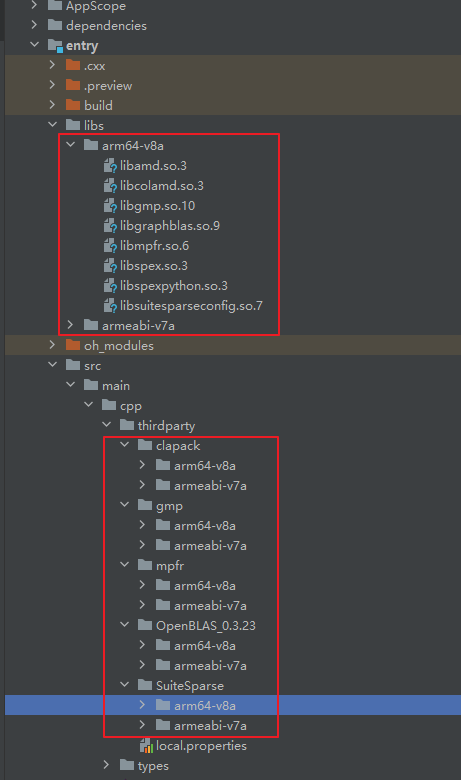
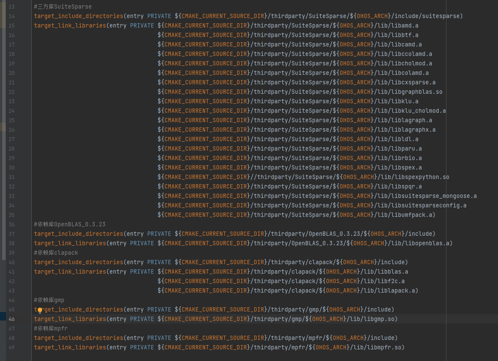

# SuiteSparse集成到应用hap

本库是在RK3568开发板上基于OpenHarmony3.2 Release版本的镜像验证的，如果是从未使用过RK3568，可以先查看[润和RK3568开发板标准系统快速上手](https://gitee.com/openharmony-sig/knowledge_demo_temp/tree/master/docs/rk3568_helloworld)。

## 开发环境

- [开发环境准备](../../../docs/hap_integrate_environment.md)

## 编译三方库

*   下载本仓库

    ```shell
    git clone https://gitee.com/openharmony-sig/tpc_c_cplusplus.git --depth=1
    ```

*   三方库目录结构

    ```shell
    tpc_c_cplusplus/thirdparty/SuiteSparse      #三方库SuiteSparse的目录结构如下
    ├── docs                                    #三方库相关文档的文件夹
    ├── HPKBUILD                                #构建脚本
    ├── HPKCHECK                                #测试脚本
    ├── OAT.xml                                 #扫描结果文件
    ├── SHA512SUM                               #三方库校验文件
    ├── README.OpenSource                       #说明三方库源码的下载地址，版本，license等信息
    ├── README_zh.md                            #三方库简介
    ```

*   在lycium目录下编译三方库

    编译环境的搭建参考[准备三方库构建环境](../../../lycium/README.md#1编译环境准备)

    ```shell
    cd lycium
    ./build.sh SuiteSparse
    ```

*   三方库头文件及生成的库

    在lycium目录下会生成usr目录，该目录下存在已编译完成的32位和64位三方库

    ```shell
    SuiteSparse/arm64-v8a         SuiteSparse/armeabi-v7a
    OpenBLAS_0.3.23/arm64-v8a     OpenBLAS_0.3.23/armeabi-v7a 
    clapack/arm64-v8a             clapack/armeabi-v7a
    gmp/arm64-v8a                 gmp/armeabi-v7a
    mpfr/arm64-v8a                mpfr/armeabi-v7a
    ```

*   [测试三方库](#测试三方库)

## 应用中使用三方库

- 在IDE的cpp目录下新增thirdparty目录，将三方库及其依赖库编译生成的头文件拷贝到该目录下。如下图所示：

&nbsp;

- 在最外层（cpp目录下）CMakeLists.txt中添加如下语句

  ```shell
  #将三方库的头文件和库文件加入工程中
  target_include_directories(entry PRIVATE ${CMAKE_CURRENT_SOURCE_DIR}/thirdparty/SuiteSparse/${OHOS_ARCH}/include/suitesparse)
  target_link_libraries(entry PRIVATE ${CMAKE_CURRENT_SOURCE_DIR}/thirdparty/SuiteSparse/${OHOS_ARCH}/lib/libamd.a
                                      ${CMAKE_CURRENT_SOURCE_DIR}/thirdparty/SuiteSparse/${OHOS_ARCH}/lib/libbtf.a
                                      ${CMAKE_CURRENT_SOURCE_DIR}/thirdparty/SuiteSparse/${OHOS_ARCH}/lib/libcamd.a
                                      ${CMAKE_CURRENT_SOURCE_DIR}/thirdparty/SuiteSparse/${OHOS_ARCH}/lib/libccolamd.a
                                      ${CMAKE_CURRENT_SOURCE_DIR}/thirdparty/SuiteSparse/${OHOS_ARCH}/lib/libcholmod.a
                                      ${CMAKE_CURRENT_SOURCE_DIR}/thirdparty/SuiteSparse/${OHOS_ARCH}/lib/libcolamd.a
                                      ${CMAKE_CURRENT_SOURCE_DIR}/thirdparty/SuiteSparse/${OHOS_ARCH}/lib/libcxsparse.a
                                      ${CMAKE_CURRENT_SOURCE_DIR}/thirdparty/SuiteSparse/${OHOS_ARCH}/lib/libgraphblas.so
                                      ${CMAKE_CURRENT_SOURCE_DIR}/thirdparty/SuiteSparse/${OHOS_ARCH}/lib/libklu.a
                                      ${CMAKE_CURRENT_SOURCE_DIR}/thirdparty/SuiteSparse/${OHOS_ARCH}/lib/libklu_cholmod.a
                                      ${CMAKE_CURRENT_SOURCE_DIR}/thirdparty/SuiteSparse/${OHOS_ARCH}/lib/liblagraph.a
                                      ${CMAKE_CURRENT_SOURCE_DIR}/thirdparty/SuiteSparse/${OHOS_ARCH}/lib/liblagraphx.a
                                      ${CMAKE_CURRENT_SOURCE_DIR}/thirdparty/SuiteSparse/${OHOS_ARCH}/lib/libldl.a
                                      ${CMAKE_CURRENT_SOURCE_DIR}/thirdparty/SuiteSparse/${OHOS_ARCH}/lib/libparu.a
                                      ${CMAKE_CURRENT_SOURCE_DIR}/thirdparty/SuiteSparse/${OHOS_ARCH}/lib/librbio.a
                                      ${CMAKE_CURRENT_SOURCE_DIR}/thirdparty/SuiteSparse/${OHOS_ARCH}/lib/libspex.a
                                      ${CMAKE_CURRENT_SOURCE_DIR}//thirdparty/SuiteSparse/${OHOS_ARCH}/lib/libspexpython.so
                                      ${CMAKE_CURRENT_SOURCE_DIR}/thirdparty/SuiteSparse/${OHOS_ARCH}/lib/libspqr.a
                                      ${CMAKE_CURRENT_SOURCE_DIR}/thirdparty/SuiteSparse/${OHOS_ARCH}/lib/libsuitesparse_mongoose.a
                                      ${CMAKE_CURRENT_SOURCE_DIR}/thirdparty/SuiteSparse/${OHOS_ARCH}/lib/libsuitesparseconfig.a
                                      ${CMAKE_CURRENT_SOURCE_DIR}/thirdparty/SuiteSparse/${OHOS_ARCH}/lib/libumfpack.a)
  #将三方库依赖库的头文件和库文件加入工程中
  #依赖库OpenBLAS_0.3.23
  target_include_directories(entry PRIVATE ${CMAKE_CURRENT_SOURCE_DIR}/thirdparty/OpenBLAS_0.3.23/${OHOS_ARCH}/include)
  target_link_libraries(entry PRIVATE ${CMAKE_CURRENT_SOURCE_DIR}/thirdparty/OpenBLAS_0.3.23/${OHOS_ARCH}/lib/libopenblas.a)
  #依赖库clapack
  target_include_directories(entry PRIVATE ${CMAKE_CURRENT_SOURCE_DIR}/thirdparty/OpenBLAS_0.3.23/${OHOS_ARCH}/include)
  target_link_libraries(entry PRIVATE ${CMAKE_CURRENT_SOURCE_DIR}/thirdparty/OpenBLAS_0.3.23/${OHOS_ARCH}/lib/libopenblas.a)
  target_include_directories(entry PRIVATE ${CMAKE_CURRENT_SOURCE_DIR}/thirdparty/clapack/${OHOS_ARCH}/include)
  target_link_libraries(entry PRIVATE ${CMAKE_CURRENT_SOURCE_DIR}/thirdparty/clapack/${OHOS_ARCH}/lib/libblas.a
                                      ${CMAKE_CURRENT_SOURCE_DIR}/thirdparty/clapack/${OHOS_ARCH}/lib/libf2c.a
                                      ${CMAKE_CURRENT_SOURCE_DIR}/thirdparty/clapack/${OHOS_ARCH}/lib/liblapack.a)
  #依赖库gmp
  target_include_directories(entry PRIVATE ${CMAKE_CURRENT_SOURCE_DIR}/thirdparty/gmp/${OHOS_ARCH}/include)
  target_link_libraries(entry PRIVATE ${CMAKE_CURRENT_SOURCE_DIR}/thirdparty/gmp/${OHOS_ARCH}/lib/libgmp.so)
  #依赖库mpfr
  target_include_directories(entry PRIVATE ${CMAKE_CURRENT_SOURCE_DIR}/thirdparty/mpfr/${OHOS_ARCH}/include)
  target_link_libraries(entry PRIVATE ${CMAKE_CURRENT_SOURCE_DIR}/thirdparty/mpfr/${OHOS_ARCH}/lib/libmpfr.so)
  ```

&nbsp;

## 测试三方库

- 编译出可执行的文件进行测试，[准备三方库测试环境](../../../lycium/README.md#3ci环境准备)

- 进入到构建目录运行测试用例（注意arm64-v8a为构建64位的目录，armeabi-v7a为构建32位的目录），执行结果如图所示
```
  cd /data/tpc_c_cplusplus/thirdparty/SuiteSparse/SuiteSparse-7.7.0/arm64-v8a-build
  ctest
```

&nbsp;

## 参考资料

*   [OpenHarmony三方库地址](https://gitee.com/openharmony-tpc)
*   [OpenHarmony知识体系](https://gitee.com/openharmony-sig/knowledge)
*   [SuiteSparse三方库地址](https://github.com/DrTimothyAldenDavis/SuiteSparse)

