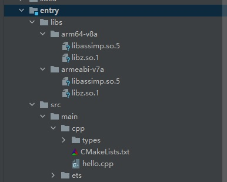

# assimp集成到应用hap
本库是在RK3568开发板上基于OpenHarmony3.2 Release版本的镜像验证的，如果是从未使用过RK3568，可以先查看[润和RK3568开发板标准系统快速上手](https://gitee.com/openharmony-sig/knowledge_demo_temp/tree/master/docs/rk3568_helloworld)。
## 开发环境
- ubuntu20.04
- [OpenHarmony3.2Release镜像](https://gitee.com/link?target=https%3A%2F%2Frepo.huaweicloud.com%2Fopenharmony%2Fos%2F3.2-Release%2Fdayu200_standard_arm32.tar.gz)
- [ohos_sdk_public 3.2.11.9 (API Version 9 Release)](https://gitee.com/link?target=https%3A%2F%2Frepo.huaweicloud.com%2Fopenharmony%2Fos%2F3.2-Release%2Fohos-sdk-windows_linux-public.tar.gz)
- [DevEco Studio 3.1 Beta2](https://gitee.com/link?target=https%3A%2F%2Fcontentcenter-vali-drcn.dbankcdn.cn%2Fpvt_2%2FDeveloperAlliance_package_901_9%2Ff3%2Fv3%2FuJyuq3syQ2ak4hE1QZmAug%2Fdevecostudio-windows-3.1.0.400.zip%3FHW-CC-KV%3DV1%26HW-CC-Date%3D20230408T013335Z%26HW-CC-Expire%3D315360000%26HW-CC-Sign%3D96262721EDC9B34E6F62E66884AB7AE2A94C2A7B8C28D6F7FC891F46EB211A70)
- [准备三方库构建环境](../../../tools/README.md#编译环境准备)
- [准备三方库测试环境](../../../tools/README.md#ci环境准备)
## 编译三方库
- 下载本仓库
  ```
  git clone https://gitee.com/openharmony-sig/tpc_c_cplusplus.git --depth=1
  ```
- 三方库目录结构
  ```
  tpc_c_cplusplus/thirdparty/assimp     #三方库assimp的目录结构如下
  ├── docs                              #三方库相关文档的文件夹
  ├── HPKBUILD                          #构建脚本
  ├── SHA512SUM                         #三方库校验文件
  ├── OAT.xml              			  #OAT文件
  ├── README.OpenSource                 #说明三方库源码的下载地址，版本，license等信息
  ├── README_zh.md   
  ```
  
- 将assimp、zlib拷贝至tools/main目录下
  ```
  cd tpc_c_cplusplus
  cp thirdparty/assimp tools/main -rf
  cp thirdparty/zlib tools/main -rf
  ```
- 在tools目录下编译三方库
  编译环境的搭建参考[准备三方库构建环境](../../../tools/README.md#编译环境准备)
  
  ```
  cd tools
  ./build.sh zlib assimp
  ```
- 三方库头文件及生成的库
  在tools目录下会生成usr目录，该目录下存在已编译完成的32位和64位三方库
  ```
  assimp/arm64-v8a   assimp/armeabi-v7a
  zlib/arm64-v8a     zlib/armeabi-v7a  
  ```

- [测试三方库](#测试三方库)

## 应用中使用三方库

- 在IDE的cpp目录下新增thirdparty目录，将编译生成的库拷贝到该目录下，如下图所示
&nbsp;
- 在最外层（cpp目录下）CMakeLists.txt中添加如下语句
  ```
  #将三方库加入工程中
  target_link_libraries(entry PRIVATE ${CMAKE_SOURCE_DIR}/../../../libs/${OHOS_ARCH}/libz.so.1)
  target_link_libraries(entry PRIVATE ${CMAKE_SOURCE_DIR}/../../../libs/${OHOS_ARCH}/libassimp.so.5)
  #将三方库的头文件加入工程中
  target_include_directories(entry PRIVATE ${CMAKE_CURRENT_SOURCE_DIR}/thirdparty/assimp/${OHOS_ARCH}/include)
  ```
  
## 测试三方库
三方库的测试使用原库自带的测试用例来做测试，[准备三方库测试环境](../../../tools/README.md#ci环境准备)

- 将编译生成的unit可执行文件及测试数据准备好

  unit 在 main/assimp/assimp-5.2.5/arm64-v8a-build/bin  

  测试数据: 

  main/assimp/assimp-5.2.5/test/models

  main/assimp/assimp-5.2.5/test/models-nonbsd      

- 将准备好的文件推送到开发板，在windows命令行进行如下操作

  ```
  hdc_std shell mount -o remount,rw /         #修改系统权限为可读写
  hdc_std file send unit /data                #将可执行文件推入开发板data目录
  hdc_std file send models/ /data             #将测试文件推入开发板data目录
  hdc_std file send models-nonbsd/ /data      #将测试文件推入开发板data目录
  hdc_std file send libc++_shared.so /system/lib64 
  hdc_std file send libz.so.1 /system/lib64
  hdc_std file send libassimp.so.5 /system/lib64
  hdc_std shell                          #进入开发板
  chmod 777 unit                         #添加权限
  ./unit                                 #执行测试用例
  ```

&nbsp;

## 参考资料
- [润和RK3568开发板标准系统快速上手](https://gitee.com/openharmony-sig/knowledge_demo_temp/tree/master/docs/rk3568_helloworld)
- [OpenHarmony三方库地址](https://gitee.com/openharmony-tpc)
- [OpenHarmony知识体系](https://gitee.com/openharmony-sig/knowledge)
- [通过DevEco Studio开发一个NAPI工程](https://gitee.com/openharmony-sig/knowledge_demo_temp/blob/master/docs/napi_study/docs/hello_napi.md)
