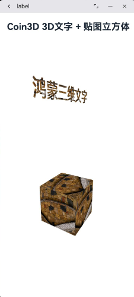

# coin3d如何集成到应用hap

本库是在 OpenHarmony 开发板上验证的，如果是从未使用过 OpenHarmony 开发板，可以先查看相关快速上手文档。

## 准备应用工程

### 准备应用开发环境
- [开发环境准备](../../../docs/hap_integrate_environment.md)

### 增加构建脚本及配置文件
- 下载本仓库
  ```
  git clone https://gitcode.com/CPF-ApplicationTPC/tpc_c_cplusplus.git --depth=1
  ```

- 三方库目录结构
  ```
  tpc_c_cplusplus/thirdparty/coin3d  #三方库coin3d的目录结构如下
  ├── docs                           #三方库相关文档的文件夹
  │   ├── pic                        #截图文件夹
  ├── HPKBUILD                       #构建脚本
  ├── SHA512SUM                      #三方库校验文件
  ├── README.OpenSource              #说明三方库源码的下载地址，版本，license等信息
  ├── README_zh.md
  ├── coin3d_oh_pkg.patch            #构建适配patch
  ```

- 在lycium目录下编译三方库
  编译环境的搭建参考[准备三方库构建环境](../../../lycium/README.md#1编译环境准备)
  ```
  cd lycium
  ./build.sh freetype2_coin3d glu coin3d
  ```
  > 注：coin3d 依赖 freetype2_coin3d 和 glu，需先编译依赖库。

- 三方库头文件及生成的库
  在lycium目录下会生成usr目录，该目录下存在已编译完成的三架构三方库
  ```
  coin3d/arm64-v8a  coin3d/armeabi-v7a  coin3d/x86_64
  ```

### 准备三方库源码
coin3d 的源码通过 git clone 从上游仓库获取，构建脚本会自动完成下载与编译。

## 应用中使用三方库

- 库的使用参考 [Coin3dDemo](https://gitcode.com/CPF-ApplicationTPC/openharmony_tpc_samples/tree/master/Coin3dDemo)，该 demo 演示了如何在 OpenHarmony 应用中集成并使用 coin3d 三方库进行 3D 场景渲染，包含了动态库（libCoin.so、libfreetype.so、libGLU.so）的引入、头文件路径配置及 CMakeLists.txt 的集成方式。
- 注意，该库需要在PC上使用，而且需要api26及以上api版本才能支持。

## 运行效果
在 OpenHarmony 开发板上运行应用，查看 3D 场景渲染效果。

  

## 参考资料
- [OpenHarmony三方库地址](https://gitee.com/openharmony-tpc)
- [OpenHarmony知识体系](https://gitee.com/openharmony-sig/knowledge)
- [Coin3D 官方网站](https://coin3d.github.io/)
- [通过DevEco Studio开发一个NAPI工程](https://gitee.com/openharmony-sig/knowledge_demo_temp/blob/master/docs/napi_study/docs/hello_napi.md)
