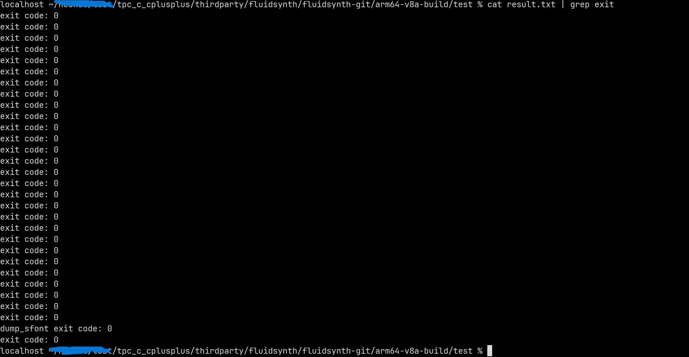

# fluidsynth集成到应用hap

本库在 OpenHarmony SDK 交叉编译链路下完成适配，可用于应用侧音频合成相关能力集成。

## 开发环境
- [开发环境准备](../../../docs/hap_integrate_environment.md)

## 编译三方库
- 下载本仓库
  ```shell
  git clone https://gitcode.com/CPF-ApplicationTPC/tpc_c_cplusplus.git --depth=1
  ```

- 三方库目录结构
  ```text
  tpc_c_cplusplus/thirdparty/fluidsynth
  ├── docs                              # 三方库文档
  ├── HPKBUILD                          # 构建脚本
  ├── HPKCHECK                          # 设备侧测试脚本
  ├── README.OpenSource                 # 开源信息说明
  ├── README_zh.md                      # 三方库说明
  ```

- 在 `lycium` 目录下编译三方库  
  编译环境搭建可参考：[准备三方库构建环境](../../../lycium/README.md#1编译环境准备)
  ```shell
  cd lycium
  ./build.sh fluidsynth
  ```

- 编译结果目录  
  在 `lycium/usr` 下可获得多架构产物：
  ```text
  fluidsynth/arm64-v8a
  fluidsynth/armeabi-v7a
  ```

## 应用中使用三方库
- 在应用工程 `cpp/thirdparty` 下放置 `fluidsynth` 对应架构产物（`include` 与 `lib` 目录）。
- 在应用工程 `cpp/CMakeLists.txt` 中添加链接与头文件目录：
  ```cmake
  target_link_libraries(entry PRIVATE ${CMAKE_CURRENT_SOURCE_DIR}/thirdparty/fluidsynth/${OHOS_ARCH}/lib/libfluidsynth.so)
  target_include_directories(entry PRIVATE ${CMAKE_CURRENT_SOURCE_DIR}/thirdparty/fluidsynth/${OHOS_ARCH}/include)
  ```

## 测试三方库
三方库测试使用原库测试目标，可参考：[准备三方库测试环境](../../../lycium/README.md#3ci环境准备)。

- 在构建目录执行测试脚本：
  ```shell
  cd thirdparty/fluidsynth/fluidsynth-git/arm64-v8a-build/
  ./test_oh.sh
  ```

- 检查用例执行结果：
  ```shell
  cat result | grep exit
  ```

- 检查脚本执行结果：确认终端输出用例执行结果，并结合测试结果文件检查失败用例。
  

## 参考资料
- [OpenHarmony三方库地址](https://gitee.com/openharmony-tpc)
- [OpenHarmony知识体系](https://gitee.com/openharmony-sig/knowledge)
- [通过DevEco Studio开发一个NAPI工程](https://gitee.com/openharmony-sig/knowledge_demo_temp/blob/master/docs/napi_study/docs/hello_napi.md)
