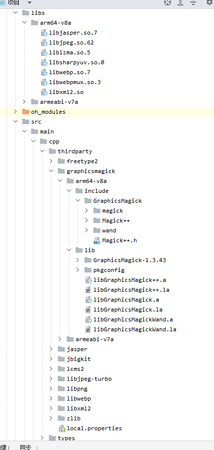
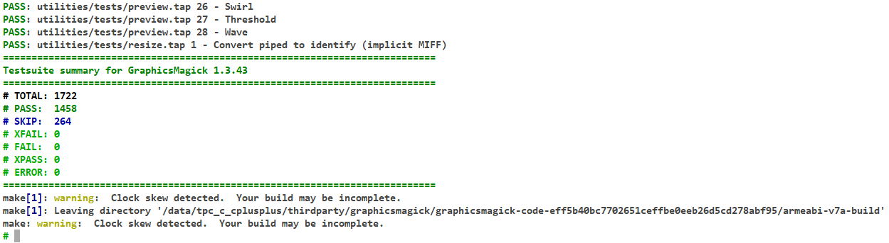

# graphicsmagick集成到应用hap
本库是在RK3568开发板上基于OpenHarmony的镜像验证的，如果是从未使用过RK3568，可以先查看[润和RK3568开发板标准系统快速上手](https://gitee.com/openharmony-sig/knowledge_demo_temp/tree/master/docs/rk3568_helloworld)。
## 开发环境
- [开发环境准备](../../../docs/hap_integrate_environment.md)
## 编译三方库
- 下载本仓库
  ```shell
  git clone https://gitee.com/openharmony-sig/tpc_c_cplusplus.git --depth=1
  ```
  
- 三方库目录结构
  ```
  tpc_c_cplusplus/thirdparty/graphicsmagick               #三方库的目录结构如下
  ├── docs                                                #三方库相关文档的文件夹
  ├── HPKBUILD                                            #构建脚本
  ├── HPKCHECK                                            #测试脚本
  ├── SHA512SUM                                           #三方库校验文件
  ├── README.OpenSource                                   #说明三方库源码的下载地址，版本，license等信息
  ├── README_zh.md                                        #三方库简介
  ├── OAT.xml                                             #扫描结果文件
  ```
  
- 在lycium目录下编译三方库，编译环境的搭建参考[准备三方库构建环境](../../../lycium/README.md#1编译环境准备)
  
  ```shell
  cd lycium
  ./build.sh graphicsmagick
  ```
  
- 三方库头文件及生成的库，在lycium目录下会生成usr目录，该目录下存在已编译完成的32位和64位三方库
  
  ```
  graphicsmagick/armeabi-v7a
  graphicsmagick/arm64-v8a
  ```
  
- [测试三方库](#测试三方库)

## 应用中使用三方库
- 在IDE的cpp目录下新增thirdparty目录，将原库生成的静态库文件、头文件及依赖库的静态库动态库拷贝到该目录下；将依赖库的SONAME名字的动态库拷贝到libs目录下，按如下图所示使用
  
  
  
- 在最外层（cpp目录下）CMakeLists.txt中添加如下语句
  ```cmake
  #将三方库加入工程中
  target_link_libraries(entry PRIVATE ${CMAKE_CURRENT_SOURCE_DIR}/thirdparty/zlib/${OHOS_ARCH}/lib/libz.a)
  target_link_libraries(entry PRIVATE ${CMAKE_CURRENT_SOURCE_DIR}/thirdparty/freetype2/${OHOS_ARCH}/lib/libfreetype.a)
  target_link_libraries(entry PRIVATE ${CMAKE_CURRENT_SOURCE_DIR}/thirdparty/lcms2/${OHOS_ARCH}/lib/liblcms2.a)
  target_link_libraries(entry PRIVATE ${CMAKE_CURRENT_SOURCE_DIR}/thirdparty/jbigkit/${OHOS_ARCH}/lib/libjbig.a)
  target_link_libraries(entry PRIVATE ${CMAKE_CURRENT_SOURCE_DIR}/thirdparty/libpng/${OHOS_ARCH}/lib/libpng16.a)
  target_link_libraries(entry PRIVATE ${CMAKE_CURRENT_SOURCE_DIR}/thirdparty/libjpeg-turbo/${OHOS_ARCH}/lib/libjpeg.a)
  target_link_libraries(entry PRIVATE ${CMAKE_CURRENT_SOURCE_DIR}/thirdparty/libjpeg-turbo/${OHOS_ARCH}/lib/libturbojpeg.a)
  target_link_libraries(entry PRIVATE ${CMAKE_CURRENT_SOURCE_DIR}/thirdparty/libwebp/${OHOS_ARCH}/lib/libwebp.so)
  target_link_libraries(entry PRIVATE ${CMAKE_CURRENT_SOURCE_DIR}/thirdparty/libwebp/${OHOS_ARCH}/lib/libwebpmux.so)
  target_link_libraries(entry PRIVATE ${CMAKE_CURRENT_SOURCE_DIR}/thirdparty/jasper/${OHOS_ARCH}/lib/libjasper.so)
  target_link_libraries(entry PRIVATE ${CMAKE_CURRENT_SOURCE_DIR}/thirdparty/libxml2/${OHOS_ARCH}/lib/libxml2.so)
  target_link_libraries(entry PRIVATE ${CMAKE_CURRENT_SOURCE_DIR}/thirdparty/graphicsmagick/${OHOS_ARCH}/lib/libGraphicsMagick.a)
  target_link_libraries(entry PRIVATE ${CMAKE_CURRENT_SOURCE_DIR}/thirdparty/graphicsmagick/${OHOS_ARCH}/lib/libGraphicsMagick++.a)
  
  #将三方库的头文件加入工程中
  target_include_directories(entry PRIVATE ${CMAKE_CURRENT_SOURCE_DIR}/thirdparty/graphicsmagick/${OHOS_ARCH}/include/GraphicsMagick)
  ```
## 测试三方库
三方库的测试使用原库提供的测试用例来做测试，[准备三方库测试环境](../../../lycium/README.md#3ci环境准备)

进入到构建目录准备测试，例如目录为arm64-v8a-build，执行单元测试

```shell
cd tpc_c_cplusplus/thirdparty/graphicsmagick/GraphicsMagick-1.3.43/arm64-v8a-build
make check-TESTS
```



## 参考资料
- [润和RK3568开发板标准系统快速上手](https://gitee.com/openharmony-sig/knowledge_demo_temp/tree/master/docs/rk3568_helloworld)
- [OpenHarmony三方库地址](https://gitee.com/openharmony-tpc)
- [OpenHarmony知识体系](https://gitee.com/openharmony-sig/knowledge)
- [通过DevEco Studio开发一个NAPI工程](https://gitee.com/openharmony-sig/knowledge_demo_temp/blob/master/docs/napi_study/docs/hello_napi.md)
