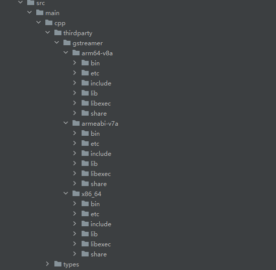
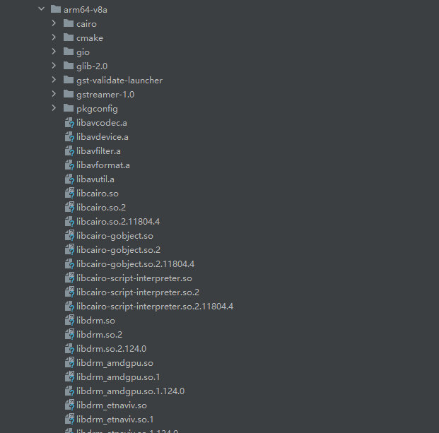
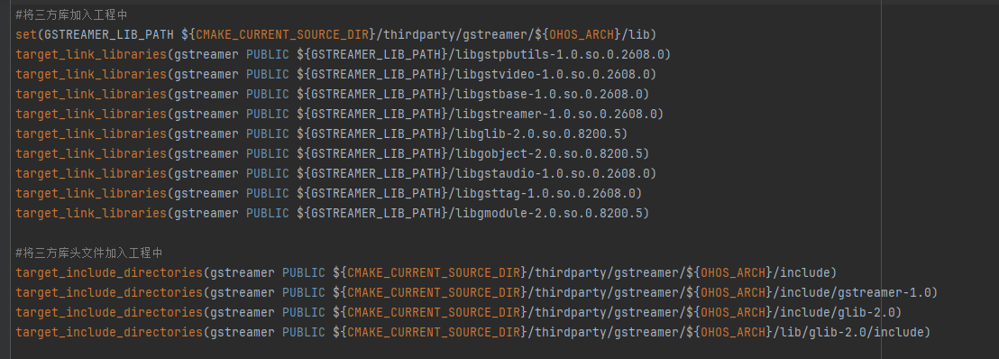
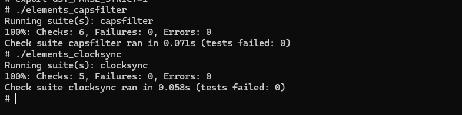

# gstreamer集成到应用hap
本库是在RK3568开发板上基于OpenHarmony3.2 Release版本的镜像验证的，如果是从未使用过RK3568，可以先查看[润和RK3568开发板标准系统快速上手](https://gitee.com/openharmony-sig/knowledge_demo_temp/tree/master/docs/rk3568_helloworld)。
## 开发环境
- [开发环境准备](../../../docs/hap_integrate_environment.md)
## 编译三方库
- 下载本仓库
  ```
  git clone https://gitee.com/openharmony-sig/tpc_c_cplusplus.git --depth=1
  ```
- 三方库目录结构
  ```
  tpc_c_cplusplus/thirdparty/gstreamer  #三方库gstreamer的目录结构如下
  ├── docs                              #三方库相关文档的文件夹
  ├── HPKCHECK                          #测试脚本
  ├── HPKBUILD                          #构建脚本
  ├── README.OpenSource                 #说明三方库源码的下载地址，版本，license等信息
  ├── README_zh.md                      #三方库中文说明文档
  ├── SHA512SUM                         #三方库校验文件
  ├── gst_ohos_pkg.patch                #patch文件
  ```

- 在lycium目录下编译三方库
  编译环境的搭建参考[准备三方库构建环境](../../../lycium/README.md#1编译环境准备)
  ```shell
  cd lycium
  ./build.sh gstreamer
  ```

- 三方库头文件及生成的库
  在lycium目录下会生成usr目录，该目录下存在已编译完成的32位和64位三方库
  
  ```
  gstreamer/arm64-v8a   gstreamer/armeabi-v7a   gstreamer/x86_64
  ```

- [测试三方库](#测试三方库)

## 应用中使用三方库

- 在IDE的cpp目录下新增thirdparty目录，将编译生成的库和头文件以及依赖的文件拷贝到该目录下，如下图所示

&nbsp;

- 使用动态库还需将所有动态库静态库文件拷贝至entry/libs目录下，如下

&nbsp;

- 在最外层（cpp目录下）CMakeLists.txt中添加如下语句
```
# 将三方库加入工程中
set(GSTREAMER_LIB_PATH ${CMAKE_CURRENT_SOURCE_DIR}/thirdparty/gstreamer/${OHOS_ARCH}/lib)
target_link_libraries(gstreamer PUBLIC ${GSTREAMER_LIB_PATH}/libgstpbutils-1.0.so.0.2608.0)
target_link_libraries(gstreamer PUBLIC ${GSTREAMER_LIB_PATH}/libgstvideo-1.0.so.0.2608.0)
target_link_libraries(gstreamer PUBLIC ${GSTREAMER_LIB_PATH}/libgstbase-1.0.so.0.2608.0)
target_link_libraries(gstreamer PUBLIC ${GSTREAMER_LIB_PATH}/libgstreamer-1.0.so.0.2608.0)
target_link_libraries(gstreamer PUBLIC ${GSTREAMER_LIB_PATH}/libglib-2.0.so.0.8200.5)
target_link_libraries(gstreamer PUBLIC ${GSTREAMER_LIB_PATH}/libgobject-2.0.so.0.8200.5)
target_link_libraries(gstreamer PUBLIC ${GSTREAMER_LIB_PATH}/libgstaudio-1.0.so.0.2608.0)
target_link_libraries(gstreamer PUBLIC ${GSTREAMER_LIB_PATH}/libgsttag-1.0.so.0.2608.0)
target_link_libraries(gstreamer PUBLIC ${GSTREAMER_LIB_PATH}/libgmodule-2.0.so.0.8200.5)

# 将三方库的头文件加入工程中
target_include_directories(gstreamer PUBLIC ${CMAKE_CURRENT_SOURCE_DIR}/thirdparty/gstreamer/${OHOS_ARCH}/include)
target_include_directories(gstreamer PUBLIC ${CMAKE_CURRENT_SOURCE_DIR}/thirdparty/gstreamer/${OHOS_ARCH}/include/gstreamer-1.0)
target_include_directories(gstreamer PUBLIC ${CMAKE_CURRENT_SOURCE_DIR}/thirdparty/gstreamer/${OHOS_ARCH}/include/glib-2.0)
target_include_directories(gstreamer PUBLIC ${CMAKE_CURRENT_SOURCE_DIR}/thirdparty/gstreamer/${OHOS_ARCH}/lib/glib-2.0/include)
```

&nbsp;

## 测试三方库
三方库的测试使用原库自带的测试用例来做测试，[准备三方库测试环境](../../../lycium/README.md#3ci环境准备)

- 将编译生成的可执行文件及生成的动态库准备好
 	 
- 将准备好的文件推送到ohos设备，进入到构建目录执行如下命令运行测试用例（arm64-v8a-build为构建64位的目录，armeabi-v7a-build为构建32位的目录），以arm64-v8a为例：
 	 
```
cp gstreamer-ohos_1.26/meson.build gstreamer-ohos_1.26/arm64-v8a-build/subprojects/gstreamer/tests/check/
cd gstreamer-ohos_1.26/arm64-v8a-build/subprojects/gstreamer/tests/check
export GST_PLUGIN_SYSTEM_PATH=""
export GST_STATE_IGNORE_ELEMENTS=""
export TZ=UTC
export GST_PLUGIN_PATH="../../plugins/"
export GST_PLUGIN_SCANNER="../../libs/gst/helpers/gst-plugin-scanner"
export GST_PARSE_STRICT=1

./elements_capsfilter
./elements_clocksync
```

&nbsp;

## 参考资料
- [OpenHarmony三方库地址](https://gitee.com/openharmony-tpc)
- [OpenHarmony知识体系](https://gitee.com/openharmony-sig/knowledge)
- [gstreamer三方库地址](https://gitlab.freedesktop.org/gstreamer/gstreamer)
