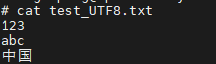
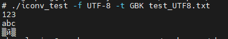
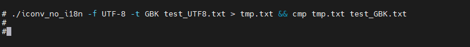
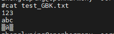
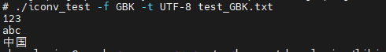
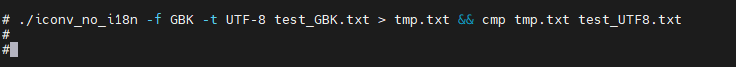

# libiconv 如何集成到系统Rom
## 准备源码工程
本库是基于OpenHarmony 3.2 beta1版本适配，并在润和RK3568开发板上验证的。
RK3568开发板如何使用可以参照[润和RK3568开发板标准系统快速上手](https://gitee.com/openharmony-sig/knowledge_demo_temp/tree/master/docs/rk3568_helloworld)。
### 准备系统Rom源码
源码获取方法请参照：[OpenHarmony3.2beta1源码下载](https://gitee.com/openharmony/docs/blob/OpenHarmony-v3.2-Beta1/zh-cn/release-notes/OpenHarmony-v3.2-beta1.md#%E6%BA%90%E7%A0%81%E8%8E%B7%E5%8F%96)
### 增加构建脚本及配置文件
- 下载本仓库代码
  ```sh
  cd ~/
  git clone git@gitee.com:openharmony-sig/tpc_c_cplusplus.git --depth=1
  ```
- 仓库代码目录结构说明
  ```shell
  cd  ~/tpc_c_cplusplus/thirdparty/iconv/	# 进入到仓库代码库目录
  ```
  ```sh
  iconv
  	|-- BUILD.gn			# Rom版编译构建脚本
  	|-- Makefile			# 生成测试用例配置文件的makefile文件
  	|-- gen_test_file.sh	# 生成测试用例配置文件的脚本
  	|-- test_GBK.txt		# 测试用例文件，存放GBK编码字符
  	|-- test_UTF8.txt		# 测试用例文件，存放UTF-8编码字符
  	|-- bundle.json			# 组件定义文件
  	|-- README_zh.md		# libiconv说明文档
  	|-- README.OpenSource	# libiconv 开源信息说明文档
  	|-- docs				# 存放libconv相关文档
  	|-- media				# 存放图片的文件夹
  	|-- adapter				# libiconv 适配的相关源码目录
  			|-- include		# 包含库相关配置头文件的文件夹
  					|-- config.h
  					|-- incov.h
  					|-- localcharset.h
  					|-- libcharset.h
  ```
- 将本仓库iconv文件夹拷贝到OpenHarmony的third_party下
  ```shell
  cp -arf ~/tpc_c_cplusplus/thirdparty/iconv ~/OpenHarmony/third_party
  ```
### 准备三方库源码
+ 将源码下载到iconv目录并将其解压出来。
  ```shell
  cd ~/OpenHarmony/third_party/iconv								# 进入到iconv目录
  wget https://ftp.gnu.org/pub/gnu/libiconv/libiconv-1.17.tar.gz  # 下载三方库
  tar -zxvf libiconv-1.17.tar.gz									# 解压库
  ```
## 系统Rom中引入三方库
准备完三方库代码后，我们需要将三方库加入到编译构建体系中。标准系统编译构建可以参考文档[标准系统编译构建指导](https://gitee.com/openharmony/docs/blob/OpenHarmony-3.2-Beta1/zh-cn/device-dev/subsystems/subsys-build-standard-large.md)。
这里我们三方库默认添加到thirdparty子系统中(详细信息参照文档[如何添加一个三方库到OpenHarmony系统中](https://gitee.com/openharmony-sig/knowledge/blob/master/docs/openharmony_getstarted/port_thirdparty/README.md#%E5%8A%A0%E5%85%A5%E7%BC%96%E8%AF%91%E6%9E%84%E5%BB%BA%E4%BD%93%E7%B3%BB))。相关配置已在bundle.json中完成，我们只需要在产品定义中添加iconv组件即可。
- 在产品配置文件中添加iconv的组件
  打开//vendor/hihope/rk3568/config.json文件，找到thirdparty子系统并添加iconv的组件
  ```json
  {
  	"subsystem": "thirdparty",
  	"components": [
  	 {
  		"component": "musl",
  		"features": []
  	 },
  	 {
  		"component": "iconv",
  		"features": []
  	 }
  	]
  }
  ```
## 系统Rom中引入三方库测试程序
libiconv原生库提供了测试用例，如需要引入测试程序，在OpenHarmony源码的vendor/hihope/rk3568/config.json文件,对应组件的features中打开编译选项：
```json
{
	"subsystem": "thirdparty",
	"components": [
	 {
		"component": "musl",
		"features": []
	 },
	 {
		"component": "iconv",
		"features": [ "enable_iconv_test=true" ]
     }
    ]
}
```
## 编译工程
- 选择产品
  ```
  hb set	## 运行hb set后会出现产品列表，在此我们选择 rk3568
  ```
- 运行编译
  ```
  hb build --target-cpu arm -f
  参数释义：
  --target-cpu arm 编译32位系统(未配置默认编译32位)，如果需要编译64位的需要改为--target-cpu arm64
  -f 全量编译，不加-f则为增量编译。每次设置完产品后建议进行全量编译。
  ```
- 正常编译完后会在out/rk3568/packages/phone/system/bin下生成iconv_test以及在out/rk3568/packages/phone/system/lib下生成libiconv.z.so。
## 安装应用程序
将编译生成的库和测试文件放到板子上运行，为避免每次将文件推入设备都烧录整个镜像，我们使用hdc_std工具将文件推到开发板上 。
- 通过源码编译生成hdc_std工具
  ```
  hb set				# 源码根目录下使用hb set 选择产品ohos-sdk
  hb build			# 最后工具编译出来在out/sdk/ohos-sdk/windows/toolchains/hdc_std.exe
  ```
-  将工具拷贝到Windows，可以为工具目录配置环境变量，也可以在工具所在目录打开windows命令 
-  将原生库测试需要的所有文件打包成iconv.tar,并拷贝到windows下 
-  将文件推送到开发板 ,具体步骤如下：
  ```shell
  hdc_std.exe shell 							## 进入开发板系统
  mount -o remount,rw /						## 修改系统权限
  exit										## 退出开发板系统
  hdc_std.exe file send .\iconv.tar /data/	## 推送文件到开发板系统的data目录
  hdc_std.exe shell
  cd /data/
  tar -xvf iconv.tar							## 解压文件包
  cd iconv
  cp libiconv.z.so	/lib/					## 将库文件拷贝到系统lib目录
  ```
## 运行效果
程序安装完后，可以通过命令行直接运行测试程序，在这里我们准备了2个测试文件，一个是GBK编码文件，一个是UTF-8编码的文件。
- UTF-8转成GBK <br />
  转换前，通过cat指令查看原编码格式：<br />
  &nbsp; <br />
  执行测试用例进行转换，终端会自动显示转换后信息： <br />
  &nbsp; <br />
  终端只能显示UTF-8的编码，所以转换GBK后，中文会显示乱码。将终端输出导入到文件(tmp.txt)后通过cmp命令与test_GBK文件进行对比，无差异
  
- GBK转成UTF-8 <br />
  转换前： <br />
  &nbsp; <br />
  转换后：<br />
  &nbsp;<br />
  终端显示正常，且将终端输出导入到文件(tmp.txt)后通过cmp命令与test_UTF8.txt文件对比，无差异 <br />
  &nbsp;
## 参考资料
- [润和RK3568开发板标准系统快速上手](https://gitee.com/openharmony-sig/knowledge_demo_temp/tree/master/docs/rk3568_helloworld)。
- [如何添加一个三方库到OpenHarmony的thirdparty子系统中](../../common/add_thirdparty_component.md)。
- [OpenHarmony3.2beta1介绍](https://gitee.com/openharmony/docs/blob/OpenHarmony-v3.2-Beta1/zh-cn/release-notes/OpenHarmony-v3.2-beta1.md)。
- [OpenHarmony三方库组织地址](https://gitee.com/openharmony-tpc)。 
- [知识体系](https://gitee.com/openharmony-sig/knowledge)。
