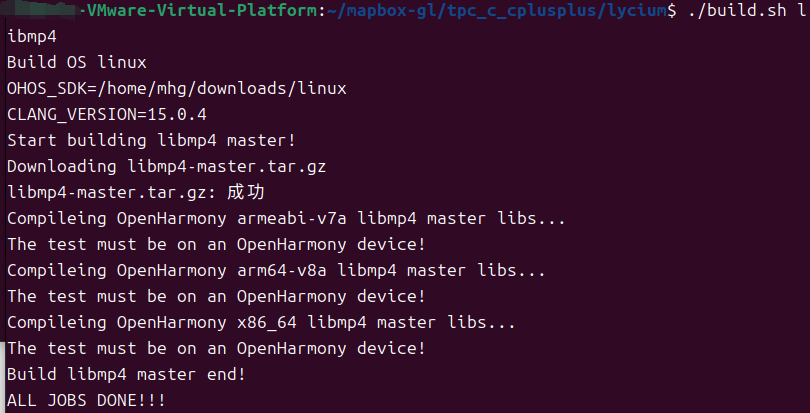
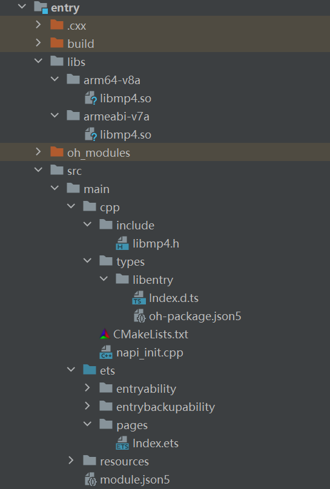
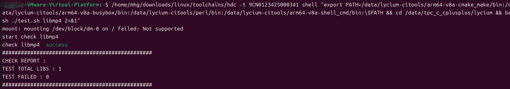

# libmp4集成到应用hap

本库是在RK3568开发板上基于OpenHarmony的镜像验证的，如果是从未使用过RK3568，可以先查看[润和RK3568开发板标准系统快速上手](https://gitee.com/openharmony-sig/knowledge_demo_temp/tree/master/docs/rk3568_helloworld)。

## 开发环境

- [开发环境准备](../../../docs/hap_integrate_environment.md)

## 编译三方库

- 下载本仓库

  ```shell
  git clone https://gitee.com/openharmony-sig/tpc_c_cplusplus.git --depth=1
  ```

- 三方库目录结构

  ```shell
  tpc_c_cplusplus/thirdparty/libmp4   #三方库libmp4的目录结构如下
  ├── docs                             	#三方库相关文档的文件夹
  ├── HPKBUILD                         	#构建脚本
  ├── HPKCHECK                         	#测试脚本
  ├── SHA512SUM                        	#三方库校验文件
  ├── README.OpenSource                	#说明三方库源码的下载地址，版本、license等信息
  ├── README_zh.md   
  ```
  
- 在lycium目录下编译三方库

  编译环境的搭建参考[准备三方库构建环境](../../../lycium/README.md#1编译环境准备)

  ```shell
  cd lycium
  ./build.sh libmp4
  ```
- 

- 三方库头文件及生成的库

  在lycium目录下会生成usr目录，该目录下存在已编译完成的32位和64位三方库

  ```shell
  libmp4/arm64-v8a   libmp4/armeabi-v7a
  ```
  
- [测试三方库](#测试三方库)

## 应用中使用三方库

- 在IDE的cpp目录下新增thirdparty目录，将生成的二进制文件以及头文件拷贝到该目录下，如下图所示
  
- 

- 在最外层（cpp目录下）CMakeLists.txt中添加如下语句

#将三方库的头文件和库文件加入工程中
target_link_libraries(entry PRIVATE ${CMAKE_CURRENT_SOURCE_DIR}/thirdparty/libmp4/${OHOS_ARCH}/lib/libmp4.so)
target_include_directories(entry PRIVATE ${CMAKE_CURRENT_SOURCE_DIR}/thirdparty/libmp4/${OHOS_ARCH}/include)

## 测试三方库

三方库的测试使用原库自带的测试用例来做测试，[准备三方库测试环境](../../../lycium/README.md#3ci环境准备)

进入到构建目录运行测试用例（注意arm64-v8a为构建64位的目录，armeabi-v7a为构建32位的目录），可以查看HPKCHECK里面单独执行每条用例的方法，这里执行一条用例test-version，结果如图所示
```shell
/home/lzp/downloads/linux/toolchains/hdc -t 9CN0123425000341 shell "export PATH=/data/lycium-citools/arm64-v8a-cmake_make/bin:/data/lycium-citools/arm64-v8a-busybox/bin:/data/lycium-citools/perl/bin:/data/lycium-citools/arm64-v8a-shell_cmd/bin:\$PATH && cd /data/tpc_c_cplusplus/lycium && bash ./test.sh libmp4 2>&1"

```

测试结果如图所示：
  - 

## 参考资料

- [OpenHarmony三方库地址](https://gitee.com/openharmony-tpc)
- [OpenHarmony知识体系](https://gitee.com/openharmony-sig/knowledge)
- [libmp4三方库地址](https://github.com/Akaaba/libmp4)
