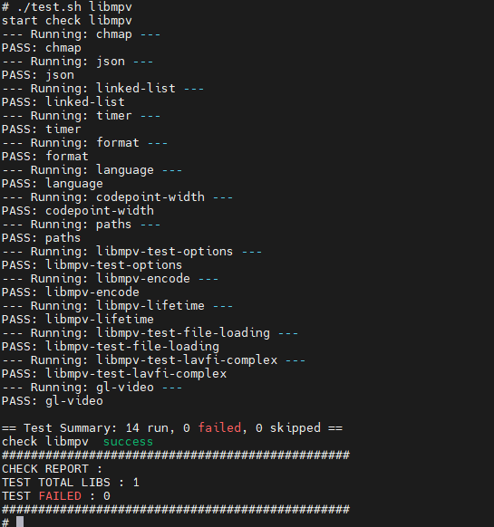

# libmpv如何集成到应用hap

## 准备应用工程

本库是在 RK3568 开发板上基于 OpenHarmony 3.2 Release 版本的镜像验证的，如果是从未使用过 RK3568，可以先查看[润和 RK3568 开发板标准系统快速上手](https://gitee.com/openharmony-sig/knowledge_demo_temp/tree/master/docs/rk3568_helloworld)。

### 准备应用开发环境

- [开发环境准备](../../../docs/hap_integrate_environment.md)

### 增加构建脚本及配置文件

- 下载本仓库

  ```shell
  git clone https://gitcode.com/CPF-ApplicationTPC/tpc_c_cplusplus.git --depth=1
  ```

- 三方库目录结构

  ```shell
  tpc_c_cplusplus/thirdparty/libmpv   # 三方库 libmpv 的目录结构如下
  ├── docs                            # 三方库相关文档的文件夹
  ├── HPKBUILD                        # 构建脚本
  ├── HPKCHECK                        # 测试脚本
  ├── OAT.xml                         # 扫描结果文件
  ├── SHA512SUM                       # 三方库校验文件
  ├── README.OpenSource               # 说明三方库源码的下载地址、版本、license 等信息
  ├── README_zh.md                    # 三方库简介
  ├── libmpv_oh_pkg.patch             # OpenHarmony 适配补丁
  ├── arm64-v8a-cross-file.txt        # arm64-v8a 交叉编译配置
  ├── armeabi-v7a-cross-file.txt        # armeabi-v7a 交叉编译配置
  └── x86_64-cross-file.txt           # x86_64 交叉编译配置
  ```

### 准备三方库源码

- 三方库下载地址：[mpv](https://gitcode.com/GitHub_Trending/mp/mpv)，版本：v0.41.0

- 在 lycium 目录下编译三方库

  编译环境的搭建参考[准备三方库构建环境](../../../lycium/README.md#1编译环境准备)。

  `HPKBUILD` 已声明依赖 `FFmpeg-ff8.0`、`libplacebo`、`libass`、`lua_5.1.1`，Lycium 会按依赖链自动编译；也可显式指定：

  ```shell
  cd lycium
  ./build.sh libmpv
  ```

- 三方库头文件及生成的库

  在 lycium 目录下会生成 usr 目录，该目录下存在已编译完成的 32 位、64 位及 x86_64 三方库：

  ```shell
  libmpv/arm64-v8a/lib/libmpv.so
  libmpv/arm64-v8a/include/mpv/
  libmpv/armeabi-v7a/lib/libmpv.so
  libmpv/armeabi-v7a/include/mpv/
  libmpv/x86_64/lib/libmpv.so
  libmpv/x86_64/include/mpv/
  ```

  构建产物为 **libmpv.so** 动态库；`libass`、`libplacebo` 等依赖已静态链入，`DT_NEEDED` 中仅保留 **FFmpeg** 相关动态库。

## 应用中使用三方库

- 在 IDE 的 cpp 目录下新增 thirdparty 目录，将编译生成的头文件（`include/mpv/`）拷贝到该目录下；将 **libmpv.so** 以及 **FFmpeg 动态库**（`libavcodec.so`、`libavformat.so`、`libavutil.so`、`libswresample.so`、`libswscale.so` 等，带版本号和不带版本号的均需）拷贝到工程的 libs 目录下。

- 在最外层（cpp 目录下）CMakeLists.txt 中添加如下语句：

  ```cmake
  # 将 libmpv 动态库加入工程
  target_link_libraries(entry PRIVATE ${CMAKE_CURRENT_SOURCE_DIR}/thirdparty/libmpv/${OHOS_ARCH}/lib/libmpv.so)
  # 将 libmpv 头文件加入工程
  target_include_directories(entry PRIVATE ${CMAKE_CURRENT_SOURCE_DIR}/thirdparty/libmpv/${OHOS_ARCH}/include)
  ```

  应用侧通过 [libmpv client API](https://mpv.io/manual/master/libmpv/)（如 `mpv/client.h`）调用播放能力；运行时需保证 FFmpeg 动态库可被加载（放入 libs 或配置 `LD_LIBRARY_PATH`）。

## 编译工程

编译工程、安装应用可以参考 [应用的安装和运行](https://gitee.com/openharmony-sig/knowledge_demo_temp/blob/master/docs/napi_study/docs/hello_napi.md#%E5%AE%89%E8%A3%85%E8%B0%83%E8%AF%95)。

## 运行效果

- 在 lycium 目录下执行 `./test.sh libmpv` 可在 OpenHarmony 设备上运行 mpv 自带单元测试，测试结果如下：

  &nbsp;

## 参考资料

- [润和 RK3568 开发板标准系统快速上手](https://gitee.com/openharmony-sig/knowledge_demo_temp/tree/master/docs/rk3568_helloworld)
- [OpenHarmony 三方库地址](https://gitee.com/openharmony-tpc)
- [OpenHarmony 知识体系](https://gitee.com/openharmony-sig/knowledge)
- [libmpv 官方文档](https://mpv.io/manual/master/libmpv/)
- [通过 DevEco Studio 开发一个 NAPI 工程](https://gitee.com/openharmony-sig/knowledge_demo_temp/blob/master/docs/napi_study/docs/hello_napi.md)
