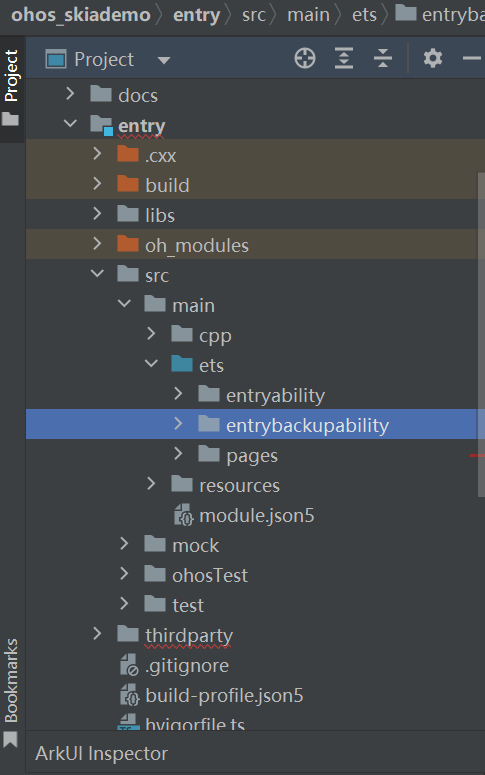
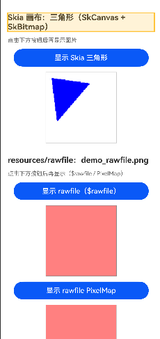

# RHVoice集成到应用hap
本库是在RK3568开发板上基于OpenHarmony3.2 Release的镜像验证的，如果是从未使用过RK3568，可以先查看[润和RK3568开发板标准系统快速上手](https://gitee.com/openharmony-sig/knowledge_demo_temp/tree/master/docs/rk3568_helloworld)。
## 开发环境
- [开发环境准备](../../../docs/hap_integrate_environment.md)
## 编译三方库
- 下载本仓库
  ```shell
  git clone https://gitcode.com/CPF-ApplicationTPC/tpc_c_cplusplus.git --depth=1
  ```
  
- 三方库目录结构
  ```
  tpc_c_cplusplus/thirdparty/libwmskia                      # 三方库的目录结构如下
  ├── docs                                                # 三方库相关文档的文件夹
  ├── HPKBUILD                                            # 构建脚本
  ├── README.OpenSource                                   # 说明三方库源码的下载地址，版本，license等信息
  └── README_zh.md                                        # 三方库简介
  ```
  
- 在lycium目录下编译三方库，编译环境的搭建参考[准备三方库构建环境](../../../lycium/README.md#1编译环境准备)
  
  ```shell
  cd lycium
  ./build.sh libwmskia
  ```

  **注意**：
   - libwmskia 底层依赖 Skia，其构建脚本（`HPKBUILD`）中通过 GN 参数控制字体相关功能的启用与库来源：
   - **功能开关**：`skia_use_freetype` 和 `skia_use_harfbuzz` 控制是否启用 FreeType 字体引擎和 HarfBuzz 文本整形功能，**默认均为开启（`true`）**，因此脚本中未显式设置。
   - **库来源控制**：`skia_use_system_freetype2=false` 和 `skia_use_system_harfbuzz=false` 表示使用 Skia 源码内置的库，而非系统库。
   - **Fontconfig**：`skia_use_fontconfig=false` 显式禁用了 Fontconfig 支持（如需启用可改为 `true`，但需提前编译 Fontconfig 依赖）。

  - 如需调整上述参数，请直接编辑 `thirdparty/libwmskia/HPKBUILD` 中的 `common_args`，所有修改均通过 GN 参数传递，**无需修改源码**。

  - 若将 `skia_use_system_*` 改为 `true` 以使用系统库，则需**提前编译对应的依赖库**（Freetype、HarfBuzz 等），并在执行 `./build.sh` 时**按依赖顺序列出库名**：
    ```bash
    ./build.sh freetype2 harfbuzz libwmskia
    ```

- 三方库头文件及生成的库，在lycium目录下会生成usr目录，该目录下存在已编译完成的32位和64位三方库
  
  ```
  libwmskia/arm64-v8a    libwmskia/armeabi-v7a
  ```
  
- [测试三方库](#测试三方库)

## 应用中使用三方库
- 在IDE的cpp目录下新增thirdparty目录，将libwmskia库生成的头文件和库拷贝到该目录下，如下图所示
  
  
  
- 在最外层（cpp目录下）CMakeLists.txt中添加如下语句
  ```makefile
  #指定编译器版本
  set(CMAKE_CXX_STANDARD 17)
  set(CMAKE_CXX_STANDARD_REQUIRED ON)

  #将三方库加入工程中
  target_link_libraries(entry PRIVATE ${CMAKE_CURRENT_SOURCE_DIR}/thirdparty/libwmskia/${OHOS_ARCH}/lib/libskia.a)

  #将三方库的头文件加入工程中
  target_include_directories(entry PRIVATE ${CMAKE_CURRENT_SOURCE_DIR}/thirdparty/libwmskia/${OHOS_ARCH}/include)
  ```
## 测试三方库
    提供demo:https://gitcode.com/openharmony-tpc/openharmony_tpc_samples



## 参考资料
- [润和RK3568开发板标准系统快速上手](https://gitee.com/openharmony-sig/knowledge_demo_temp/tree/master/docs/rk3568_helloworld)
- [OpenHarmony三方库地址](https://gitee.com/openharmony-tpc)
- [OpenHarmony知识体系](https://gitee.com/openharmony-sig/knowledge)
- [通过DevEco Studio开发一个NAPI工程](https://gitee.com/openharmony-sig/knowledge_demo_temp/blob/master/docs/napi_study/docs/hello_napi.md)
