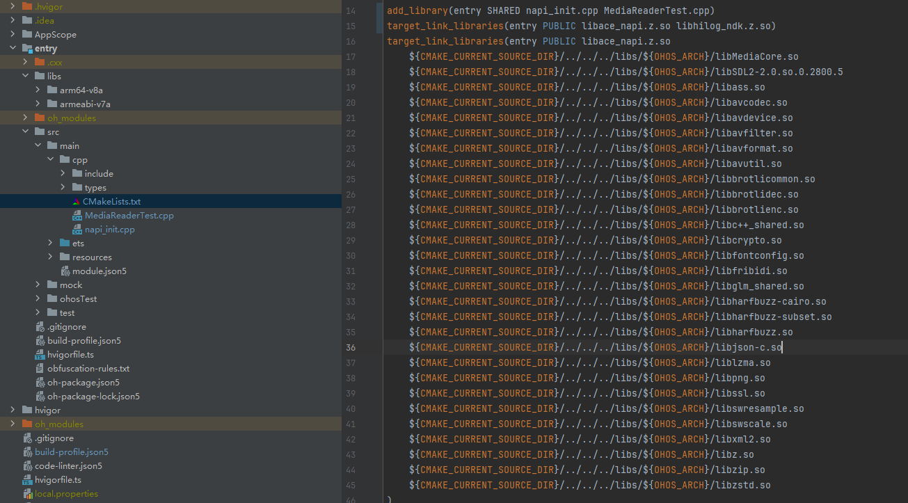
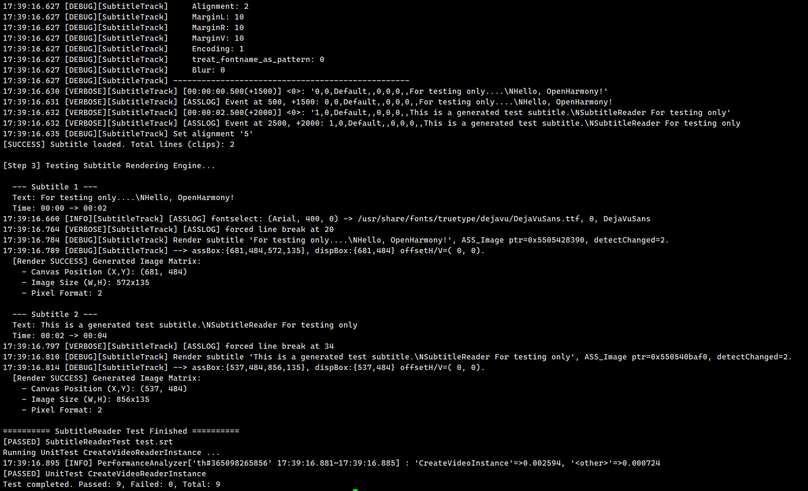

# mediacore集成到应用hap
本库是在RK3568开发板上基于OpenHarmony6.1 Release版本的镜像验证的，如果是从未使用过RK3568，可以先查看[润和RK3568开发板标准系统快速上手](https://gitee.com/openharmony-sig/knowledge_demo_temp/tree/master/docs/rk3568_helloworld)。
## 开发环境

- [开发环境准备](../../../docs/hap_integrate_environment.md)

## 编译三方库
- 下载本仓库
  ```
  git clone https://gitee.com/openharmony-sig/tpc_c_cplusplus.git --depth=1
  ```
  
- 三方库目录结构
  ```
  tpc_c_cplusplus/thirdparty/mediacore  #三方库miniini的目录结构如下
  ├── docs                              #三方库相关文档的文件夹
  ├── HPKBUILD                          #构建脚本
  ├── HPKCHECK                          #检验脚本
  ├── README.OpenSource                 #说明三方库源码的下载地址，版本，license等信息
  ├── README_zh.md
  ├── mediacore_oh_patch.patch          #构建脚本适配补丁
  ├── mediacore_oh_test.patch           #测试用例适配补丁
  ```
  
- 在lycium目录下编译三方库
  编译环境的搭建参考[准备三方库构建环境](../../../lycium/README.md#1编译环境准备)
```
  cd lycium
  ./build.sh mediacore
```

- 三方库头文件及生成的库
  在lycium目录下会生成usr目录，该目录下存在已编译完成的32位和64位三方库
  
  ```
  mediacore/arm64-v8a   mediacore/armeabi-v7a   mediacore/x86_64
  ```
  
- [测试三方库](#测试三方库)

## 应用中使用三方库

- 在IDE的entry/libs目录中，将编译生成的库拷贝到该目录下，如下图所示




## 测试三方库

三方库的测试使用原库自带的测试用例来做测试，[准备三方库测试环境](../../../lycium/README.md#3ci环境准备)

进入到构建目录，将相关依赖库推送到测试手机上，并配置环境。（arm64-v8a-build为构建64位的目录，armeabi-v7a-build为构建32位的目录）
- 推送MediaReaderTest测试程序和test.mp4测试文件。
- 进入测试目录，依次执行 9 个测试文件
  ```
  cd /data/tpc_c_cplusplus/thirdparty/mediacore/mediacore-4c4386837d596368e483d6c2a2f09cd37788af7f/MediaCore/arm64-v8a-build
  ./HwaccelManagerTest
  ./MediaEncoderTest test.mp4 out.mp4
  ./MediaReaderTest test.mp4
  ./MultiTrackAudioTest test.mp4
  ./MultiTrackVideoTest test.mp4
  ./OverviewTest test.mp4
  ./SnapshotTest test.mp4
  ./SubtitleReaderTest test.srt
  ./UnitTest CreateVideoReaderInstance
  ```

- 测试过程示意图：

&nbsp;

## 参考资料
- [润和RK3568开发板标准系统快速上手](https://gitee.com/openharmony-sig/knowledge_demo_temp/tree/master/docs/rk3568_helloworld)
- [OpenHarmony三方库地址](https://gitee.com/openharmony-tpc)
- [OpenHarmony知识体系](https://gitee.com/openharmony-sig/knowledge)
- [通过DevEco Studio开发一个NAPI工程](https://gitee.com/openharmony-sig/knowledge_demo_temp/blob/master/docs/napi_study/docs/hello_napi.md)
