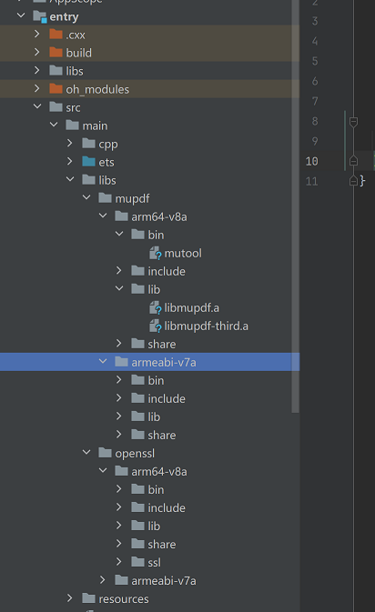
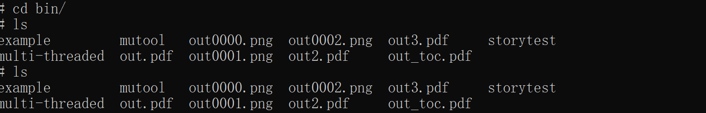
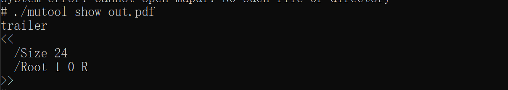

# mupdf 集成到应用hap

本库是在RK3568开发板上基于OpenHarmony3.2 Release版本的镜像验证的，如果是从未使用过RK3568，可以先查看[润和RK3568开发板标准系统快速上手](https://gitee.com/openharmony-sig/knowledge_demo_temp/tree/master/docs/rk3568_helloworld)。

## 开发环境

- [开发环境准备](../../../docs/hap_integrate_environment.md)

## 编译三方库

- 下载本仓库

  ```shell
  git clone https://gitee.com/openharmony-sig/tpc_c_cplusplus.git --depth=1
  ```

- 三方库目录结构

  ```
    tpc_c_cplusplus/thirdparty/mupdf		    #三方库mupdf的目录结构如下
    ├── mupdf                                #三方库mupdf的目录
    │   ├── HPKBUILD						#构建脚本		
    │   ├── HPKCHECK						#测试脚本
    │   ├── README.OpenSource				#说明三方库源码的下载地址，版本，license等信息
    │   ├── README_zh.md					# mupdf 三方库说明
    │   ├── SHA512SUM						#三方库校验文件
    │   └── docs                            #三方库相关文档的文件夹
    │       ├── pic
    │       │   ├── mupdf.png
    │       │   └── test-mupdf.png
    │       └── hap_integrate.md 
  ```
  
- 在lycium目录下编译三方库

  编译环境的搭建参考[准备三方库构建环境](../../../lycium/README.md#1编译环境准备)

  ```
  cd lycium
  ./build.sh mupdf
  ```

- 三方库头文件及生成的库

  在lycium目录下会生成usr目录，该目录下存在已编译完成的32位和64位三方库

  ```
  mupdf/arm64-v8a   mupdf/armeabi-v7a
  ```

- [测试三方库](#测试三方库)

## 应用中使用三方库

- 在IDE的cpp目录下新增thirdparty目录，将编译生成的文件都拷贝到该目录下，如下图所示：

  &nbsp;

  将编译生成的三方动态库（动态库名字带版本号和不带版本号的都需要）拷贝到工程的libs目录下:

  &nbsp;

- 在最外层（cpp目录下）CMakeLists.txt中添加如下语句：

  ```makefile
  #将三方库加入工程中
  set(MUPDF_ROOT "${CMAKE_CURRENT_SOURCE_DIR}/../../main/libs/mupdf/${OHOS_ARCH}")
  set(OPENSSL_ROOT "${CMAKE_CURRENT_SOURCE_DIR}/../../main/libs/openssl/${OHOS_ARCH}")
  target_link_libraries(entry PUBLIC
      libace_napi.z.so
       ${MUPDF_ROOT}/lib/libmupdf.a
       ${MUPDF_ROOT}/lib/libmupdf-third.a
       ${OPENSSL_ROOT}/lib/libcrypto.so.1.1
       ${OPENSSL_ROOT}/lib/libssl.so.1.1
  )
  #将三方库及其依赖库的头文件加入工程中
  include_directories(
      ${MUPDF_ROOT}/include
      ${OPENSSL_ROOT}/include
  )
  ```


## 测试三方库

三方库的测试使用原库自带的demo来做测试，[准备三方库测试环境](../../../lycium/README.md#3ci环境准备)

进入到构建目录data/tpc_c_cplusplus/thirdparty/lyciumusr/mupdf/armeabi-v7a/bin，分别有mutool，example，multi-threaded，storytest这四个文件，执行编译出来的这几个可执行文件（arm64-v8a-build为构建64位的目录，armeabi-v7a-build为构建32位的目录）。storytest用于html格式转pdf，multi-threaded用于将paf文件转成png图片，mutool用于pdf文件的解析。然后在/data/tpc_c_cplusplus/lycium/usr/mupdf/armeabi-v7a/bin路径下查看相应的pdf文件和图片是否生成，以及能否正常解析pdf文件。
测试用例结果如下：&nbsp;



## 参考资料

- [润和RK3568开发板标准系统快速上手](https://gitee.com/openharmony-sig/knowledge_demo_temp/tree/master/docs/rk3568_helloworld)
- [OpenHarmony三方库地址](https://gitee.com/openharmony-tpc)
- [OpenHarmony知识体系](https://gitee.com/openharmony-sig/knowledge)
- [通过DevEco Studio开发一个NAPI工程](https://gitee.com/openharmony-sig/knowledge_demo_temp/blob/master/docs/napi_study/docs/hello_napi.md)