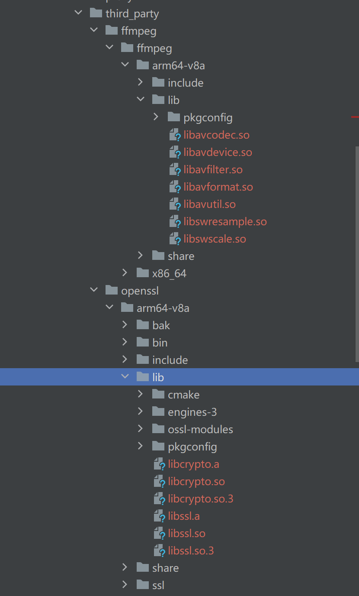
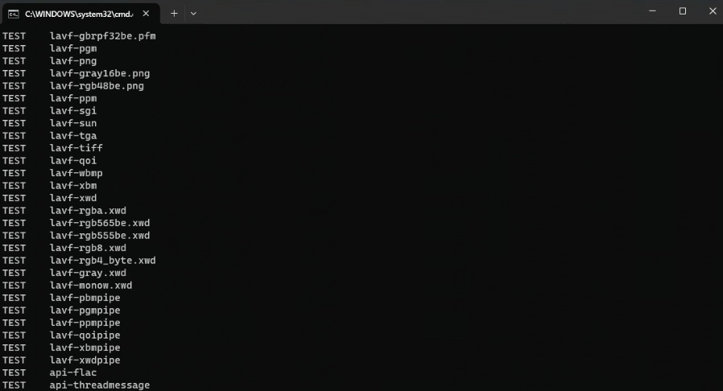
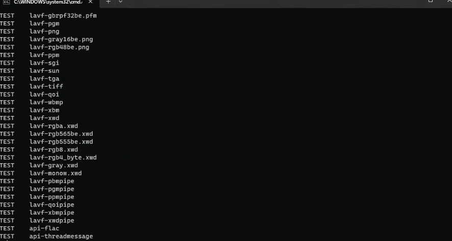
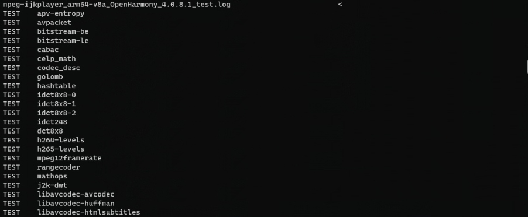

# ohos_ffmpeg-ff8.0如何集成到应用hap

## 准备应用工程

本库是在RK3568开发板上基于OpenHarmony3.2 Release版本的镜像验证的，如果是从未使用过RK3568，可以先查看[润和RK3568开发板标准系统快速上手](https://gitee.com/openharmony-sig/knowledge_demo_temp/tree/master/docs/rk3568_helloworld)。应用工程可参考[通过DevEco Studio开发一个NAPI工程](https://gitee.com/openharmony-sig/knowledge_demo_temp/blob/master/docs/napi_study/docs/hello_napi.md)，使用 DevEco Studio 创建 Native C++（NAPI）工程。

### 准备应用开发环境

- [开发环境准备](../../../docs/hap_integrate_environment.md)

### 增加构建脚本及配置文件

- 下载本仓库

  ```shell
  git clone https://gitcode.com/CPF-ApplicationTPC/tpc_c_cplusplus.git --depth=1
  ```

- 三方库目录结构

  ```shell
  tpc_c_cplusplus/thirdparty/ohos_ffmpeg-ff8.0     #三方库FFmpeg的目录结构如下
  ├── docs                              #三方库相关文档的文件夹
  ├── HPKBUILD                          #构建脚本
  ├── HPKCHECK                          #验证脚本
  ├── README.OpenSource                 #说明三方库源码的下载地址，版本，license等信息
  ├── README_zh.md
  ```

- 在应用工程 `entry/src/main/cpp` 下新增 `thirdparty`（或 `third_party`）目录，用于存放预编译产物与头文件；工程侧构建脚本为 cpp 目录下的 `CMakeLists.txt`（见下文「应用中使用三方库」）。

### 准备三方库源码

- 本库通过 Lycium 交叉编译，源码由 `HPKBUILD` 拉取（分支 `ohos-n8.0`），版本与 License 见 [README.OpenSource](../README.OpenSource)。
- 编译环境的搭建参考[准备三方库构建环境](../../../lycium/README.md#1编译环境准备)。

  ```shell
  cd lycium
  ./build.sh ohos_ffmpeg-ff8.0
  ```

- 三方库头文件及生成的库

  在 lycium 目录下会生成 `usr` 目录，该目录下存在已编译完成的三方库，例如：

  ```shell
  ohos_ffmpeg-ff8.0/arm64-v8a
  ohos_ffmpeg-ff8.0/armeabi-v7a
  ohos_ffmpeg-ff8.0/x86_64
  ```

  同时需一并准备依赖库 `openssl_3.4.3` 对应架构的头文件与动态库。

- [测试三方库](#测试三方库)

## 应用中使用三方库

- 在 IDE 的 cpp 目录下新增 thirdparty 目录，将编译生成的库拷贝到该目录下，如下图所示
  &nbsp;

  

- 在最外层（cpp 目录下）CMakeLists.txt 中添加如下语句

  ```cmake
  #修改文件CMakeLists.txt
  #因为此三方库中存在汇编编译的部分，所以需要修改CFLAGS参考如下，符号不可抢占且优先使用本地符号
  set(CMAKE_C_FLAGS "${CMAKE_C_FLAGS} -Wno-int-conversion -Wl,-Bsymbolic")
  set(CMAKE_CXX_FLAGS "${CMAKE_CXX_FLAGS} -Wno-int-conversion -Wl,-Bsymbolic")
  #将FFmpeg以及依赖库openssl声明为外部引入
  # FFmpeg prebuilt shared libraries (IMPORTED SHARED for hvigor runtimeFiles tracking).
  set(FFMPEG_LIB_DIR "${CMAKE_CURRENT_SOURCE_DIR}/third_party/ffmpeg/ffmpeg/${OHOS_ARCH}/lib")
  set(FFMPEG_IMPORTED_LIBS avcodec avfilter avformat avutil swresample swscale avdevice)
  foreach(_ffmpeg_lib ${FFMPEG_IMPORTED_LIBS})
      add_library(${_ffmpeg_lib} SHARED IMPORTED)
      set_target_properties(${_ffmpeg_lib} PROPERTIES
          IMPORTED_LOCATION "${FFMPEG_LIB_DIR}/lib${_ffmpeg_lib}.so")
  endforeach()

  # OpenSSL prebuilt shared libraries (SONAME: libssl.so.3 / libcrypto.so.3).
  set(OPENSSL_LIB_DIR "${CMAKE_CURRENT_SOURCE_DIR}/third_party/openssl/${OHOS_ARCH}/lib")
  add_library(ssl SHARED IMPORTED)
  set_target_properties(ssl PROPERTIES
      IMPORTED_LOCATION "${OPENSSL_LIB_DIR}/libssl.so.3")
  add_library(crypto SHARED IMPORTED)
  set_target_properties(crypto PROPERTIES
      IMPORTED_LOCATION "${OPENSSL_LIB_DIR}/libcrypto.so.3")

  #将三方库的头文件加入工程中
  target_include_directories(entry PRIVATE ${CMAKE_CURRENT_SOURCE_DIR}/thirdparty/ffmpeg/ffmpeg/${OHOS_ARCH}/include)
  target_include_directories(entry PRIVATE ${CMAKE_CURRENT_SOURCE_DIR}/thirdparty/openssl/${OHOS_ARCH}/include)

  #链接上一步导入的目标
  target_link_libraries(entry avcodec)
  target_link_libraries(entry avfilter)
  target_link_libraries(entry avformat)
  target_link_libraries(entry avutil)
  target_link_libraries(entry swresample)
  target_link_libraries(entry swscale)
  target_link_libraries(entry avdevice)
  target_link_libraries(entry crypto)
  target_link_libraries(entry ssl)
  ```

- 调用三方库须知

  ```c
  #调用需注意
  #FFmpeg 是 C 库；C++ 包含其头文件时用 extern "C"，保证声明与库的 C 链接一致，参考如下
  #ifdef __cplusplus
  extern "C" {
  #endif
  #include "libavcodec/avcodec.h"
  #include "libavutil/avutil.h"
  #include "libswscale/swscale.h"
  #include "libavutil/imgutils.h"
  #include "libswresample/swresample.h"
  #include "libavutil/timestamp.h"
  #include "libavutil/mathematics.h"
  #include "libavutil/opt.h"
  #include "libavutil/avassert.h"
  #include "libavformat/avformat.h"
  #ifdef __cplusplus
  }
  #endif
  ```

## 编译工程

- 完成签名、SDK 与设备连接后，在 DevEco Studio 中选择目标设备，点击「运行」，即可完成应用编译、安装与启动。可参考[应用的安装和运行](https://gitee.com/openharmony-sig/knowledge_demo_temp/blob/master/docs/napi_study/docs/hello_napi.md#%E5%AE%89%E8%A3%85%E8%B0%83%E8%AF%95)。

## 运行效果

- 将集成 FFmpeg 的 NAPI 应用安装到设备后，可在业务中调用编解码、解复用等接口验证功能（如打开媒体文件、解码音视频帧）。
- 若有样例工程或演示截图，可补充至 `docs/pic/` 并在此引用；当前可参考仓库内测试验证截图：

  &nbsp;
  &nbsp;
  &nbsp;

## 测试三方库

三方库的测试使用原库自带的测试用例来做测试，[准备三方库测试环境](../../../lycium/README.md#3ci环境准备)

进入到 lycium 目录下，执行：

```shell
./test.sh ohos_ffmpeg-ff8.0
```

结果如图所示：

&nbsp;
&nbsp;
&nbsp;

## 参考资料

- [润和RK3568开发板标准系统快速上手](https://gitee.com/openharmony-sig/knowledge_demo_temp/tree/master/docs/rk3568_helloworld)
- [OpenHarmony三方库地址](https://gitee.com/openharmony-tpc)
- [OpenHarmony知识体系](https://gitee.com/openharmony-sig/knowledge)
- [通过DevEco Studio开发一个NAPI工程](https://gitee.com/openharmony-sig/knowledge_demo_temp/blob/master/docs/napi_study/docs/hello_napi.md)
