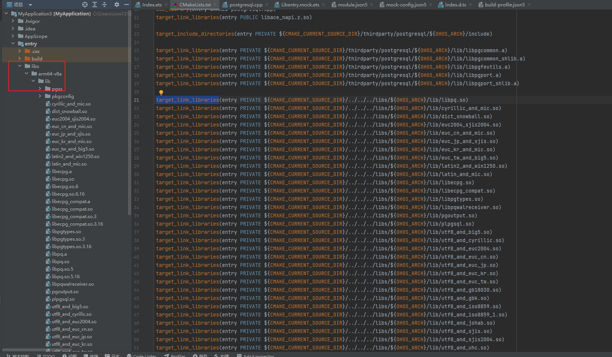
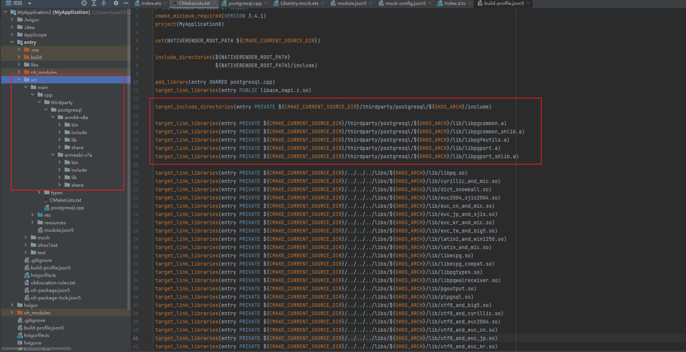

# postgresql集成到应用hap

本库是在RK3568开发板上基于OpenHarmony3.2 Release版本的镜像验证的，如果是从未使用过RK3568，可以先查看[润和RK3568开发板标准系统快速上手](https://gitee.com/openharmony-sig/knowledge_demo_temp/tree/master/docs/rk3568_helloworld)。

## 开发环境

- [开发环境准备](../../../docs/hap_integrate_environment.md)

## 编译三方库

- 下载本仓库

  ```shell
  git clone https://gitee.com/openharmony-sig/tpc_c_cplusplus.git --depth=1
  ```

- 三方库目录结构

  ```shell
  tpc_c_cplusplus/thirdparty/postgresql      #三方库postgresql的目录结构如下
  ├── docs                                   #三方库相关文档的文件              
  ├── HPKBUILD                               #构建脚本
  ├── HPKCHECK                               #测试脚本
  ├── SHA512SUM                              #三方库校验文件
  ├── README.OpenSource                      #说明三方库源码的下载地址，版本、license等信息
  ├── README_zh.md   
  ```
  
- 在lycium目录下编译三方库

  编译环境的搭建参考[准备三方库构建环境](../../../lycium/README.md#1编译环境准备)

  ```shell
  cd lycium
  ./build.sh postgresql
  ```

- 三方库头文件及生成的库

  在lycium目录下会生成usr目录，该目录下存在已编译完成的32位和64位三方库

  ```shell
  postgresql/arm64-v8a   postgresql/armeabi-v7a
  ```
  
- [测试三方库](#测试三方库)

## 应用中使用三方库

- 需要将postgresql生成的so动态库文件下图所示拷贝到entry/libs目录下

- 

- 在IDE的cpp目录下新增thirdparty目录，将编译生成的库和头文件拷贝到该目录下，如下图所示

- 

- 在最外层（cpp目录下）CMakeLists.txt中添加如下语句

  ```cmake
  target_include_directories(entry PRIVATE ${CMAKE_CURRENT_SOURCE_DIR}/thirdparty/postgresql/${OHOS_ARCH}/include)

  target_link_libraries(entry PRIVATE ${CMAKE_CURRENT_SOURCE_DIR}/thirdparty/postgresql/${OHOS_ARCH}/lib/libpgcommon.a)
  target_link_libraries(entry PRIVATE ${CMAKE_CURRENT_SOURCE_DIR}/thirdparty/postgresql/${OHOS_ARCH}/lib/libpgcommon_shlib.a)
  target_link_libraries(entry PRIVATE ${CMAKE_CURRENT_SOURCE_DIR}/thirdparty/postgresql/${OHOS_ARCH}/lib/libpgfeutils.a)
  target_link_libraries(entry PRIVATE ${CMAKE_CURRENT_SOURCE_DIR}/thirdparty/postgresql/${OHOS_ARCH}/lib/libpgport.a)
  target_link_libraries(entry PRIVATE ${CMAKE_CURRENT_SOURCE_DIR}/thirdparty/postgresql/${OHOS_ARCH}/lib/libpgport_shlib.a)

  target_link_libraries(entry PRIVATE ${CMAKE_CURRENT_SOURCE_DIR}/../../../libs/${OHOS_ARCH}/lib/libpq.so)
  target_link_libraries(entry PRIVATE ${CMAKE_CURRENT_SOURCE_DIR}/../../../libs/${OHOS_ARCH}/lib/cyrillic_and_mic.so)
  target_link_libraries(entry PRIVATE ${CMAKE_CURRENT_SOURCE_DIR}/../../../libs/${OHOS_ARCH}/lib/dict_snowball.so)
  target_link_libraries(entry PRIVATE ${CMAKE_CURRENT_SOURCE_DIR}/../../../libs/${OHOS_ARCH}/lib/euc2004_sjis2004.so)
  target_link_libraries(entry PRIVATE ${CMAKE_CURRENT_SOURCE_DIR}/../../../libs/${OHOS_ARCH}/lib/euc_cn_and_mic.so)
  target_link_libraries(entry PRIVATE ${CMAKE_CURRENT_SOURCE_DIR}/../../../libs/${OHOS_ARCH}/lib/euc_jp_and_sjis.so)
  target_link_libraries(entry PRIVATE ${CMAKE_CURRENT_SOURCE_DIR}/../../../libs/${OHOS_ARCH}/lib/euc_kr_and_mic.so)
  target_link_libraries(entry PRIVATE ${CMAKE_CURRENT_SOURCE_DIR}/../../../libs/${OHOS_ARCH}/lib/euc_tw_and_big5.so)
  target_link_libraries(entry PRIVATE ${CMAKE_CURRENT_SOURCE_DIR}/../../../libs/${OHOS_ARCH}/lib/latin2_and_win1250.so)
  target_link_libraries(entry PRIVATE ${CMAKE_CURRENT_SOURCE_DIR}/../../../libs/${OHOS_ARCH}/lib/latin_and_mic.so)
  target_link_libraries(entry PRIVATE ${CMAKE_CURRENT_SOURCE_DIR}/../../../libs/${OHOS_ARCH}/lib/libecpg.so)
  target_link_libraries(entry PRIVATE ${CMAKE_CURRENT_SOURCE_DIR}/../../../libs/${OHOS_ARCH}/lib/libecpg_compat.so)
  target_link_libraries(entry PRIVATE ${CMAKE_CURRENT_SOURCE_DIR}/../../../libs/${OHOS_ARCH}/lib/libpgtypes.so)
  target_link_libraries(entry PRIVATE ${CMAKE_CURRENT_SOURCE_DIR}/../../../libs/${OHOS_ARCH}/lib/libpqwalreceiver.so)
  target_link_libraries(entry PRIVATE ${CMAKE_CURRENT_SOURCE_DIR}/../../../libs/${OHOS_ARCH}/lib/pgoutput.so)
  target_link_libraries(entry PRIVATE ${CMAKE_CURRENT_SOURCE_DIR}/../../../libs/${OHOS_ARCH}/lib/plpgsql.so)
  target_link_libraries(entry PRIVATE ${CMAKE_CURRENT_SOURCE_DIR}/../../../libs/${OHOS_ARCH}/lib/utf8_and_big5.so)
  target_link_libraries(entry PRIVATE ${CMAKE_CURRENT_SOURCE_DIR}/../../../libs/${OHOS_ARCH}/lib/utf8_and_cyrillic.so)
  target_link_libraries(entry PRIVATE ${CMAKE_CURRENT_SOURCE_DIR}/../../../libs/${OHOS_ARCH}/lib/utf8_and_euc2004.so)
  target_link_libraries(entry PRIVATE ${CMAKE_CURRENT_SOURCE_DIR}/../../../libs/${OHOS_ARCH}/lib/utf8_and_euc_cn.so)
  target_link_libraries(entry PRIVATE ${CMAKE_CURRENT_SOURCE_DIR}/../../../libs/${OHOS_ARCH}/lib/utf8_and_euc_jp.so)
  target_link_libraries(entry PRIVATE ${CMAKE_CURRENT_SOURCE_DIR}/../../../libs/${OHOS_ARCH}/lib/utf8_and_euc_kr.so)
  target_link_libraries(entry PRIVATE ${CMAKE_CURRENT_SOURCE_DIR}/../../../libs/${OHOS_ARCH}/lib/utf8_and_euc_tw.so)
  target_link_libraries(entry PRIVATE ${CMAKE_CURRENT_SOURCE_DIR}/../../../libs/${OHOS_ARCH}/lib/utf8_and_gb18030.so)
  target_link_libraries(entry PRIVATE ${CMAKE_CURRENT_SOURCE_DIR}/../../../libs/${OHOS_ARCH}/lib/utf8_and_gbk.so)
  target_link_libraries(entry PRIVATE ${CMAKE_CURRENT_SOURCE_DIR}/../../../libs/${OHOS_ARCH}/lib/utf8_and_iso8859.so)
  target_link_libraries(entry PRIVATE ${CMAKE_CURRENT_SOURCE_DIR}/../../../libs/${OHOS_ARCH}/lib/utf8_and_iso8859_1.so)
  target_link_libraries(entry PRIVATE ${CMAKE_CURRENT_SOURCE_DIR}/../../../libs/${OHOS_ARCH}/lib/utf8_and_johab.so)
  target_link_libraries(entry PRIVATE ${CMAKE_CURRENT_SOURCE_DIR}/../../../libs/${OHOS_ARCH}/lib/utf8_and_sjis.so)
  target_link_libraries(entry PRIVATE ${CMAKE_CURRENT_SOURCE_DIR}/../../../libs/${OHOS_ARCH}/lib/utf8_and_sjis2004.so)
  target_link_libraries(entry PRIVATE ${CMAKE_CURRENT_SOURCE_DIR}/../../../libs/${OHOS_ARCH}/lib/utf8_and_uhc.so)
  target_link_libraries(entry PRIVATE ${CMAKE_CURRENT_SOURCE_DIR}/../../../libs/${OHOS_ARCH}/lib/utf8_and_win.so)
  ```


## 测试三方库

三方库的测试使用原库自带的测试用例来做测试，[准备三方库测试环境](../../../lycium/README.md#3ci环境准备)

进入到对应版本目录,执行如下命令make check


## 参考资料

- [OpenHarmony三方库地址](https://gitee.com/openharmony-tpc)
- [OpenHarmony知识体系](https://gitee.com/openharmony-sig/knowledge)
- [通过DevEco Studio开发一个NAPI工程](https://gitee.com/openharmony-sig/knowledge_demo_temp/blob/master/docs/napi_study/docs/hello_napi.md)
