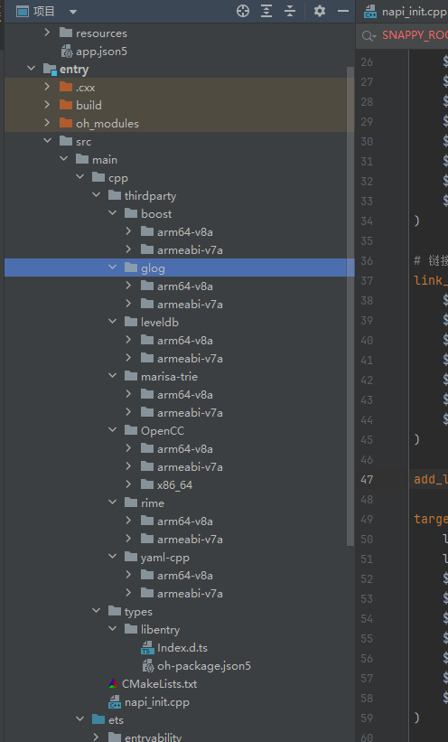
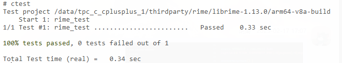

# rime集成到应用hap

本库是在RK3568开发板上基于OpenHarmony3.2 Release版本的镜像验证的，如果是从未使用过RK3568，可以先查看[润和RK3568开发板标准系统快速上手](https://gitee.com/openharmony-sig/knowledge_demo_temp/tree/master/docs/rk3568_helloworld)。

## 开发环境
- [开发环境准备](../../../docs/hap_integrate_environment.md)

## 编译三方库

- 下载本仓库

  ```shell
  git clone https://gitee.com/openharmony-sig/tpc_c_cplusplus.git --depth=1
  ```

- 三方库目录结构

  ```shell
  tpc_c_cplusplus/thirdparty/rime          #三方库rime的目录结构如下
  ├── docs                                 # 三方库相关文档的文件夹                     
  ├── HPKBUILD                             # 构建脚本
  ├── HPKCHECK                             # 测试脚本
  ├── SHA512SUM                            # 三方库校验文件
  ├── README.OpenSource                    # 说明三方库源码的下载地址，版本，license等信息
  ├── README_zh.md                         # 三方库说明文档
  ├── OAT.xml                              # OAT开源审查文本
  ```

- 在lycium目录下编译三方库

  编译环境的搭建参考[准备三方库构建环境](../../../lycium/README.md#1编译环境准备)

  ```shell
  cd lycium
  ./build.sh rime
  ```

- 三方库头文件及生成的库

  在lycium目录下会生成usr目录，该目录下存在已编译完成的32位和64位三方库

  ```shell
  rime/arm64-v8a   rime/armeabi-v7a
  ```
  
- [测试三方库](#测试三方库)

## 应用中使用三方库

- 在IDE的cpp目录下新增thirdparty目录，将编译生成的库拷贝到该目录下，如下图所示
  &nbsp;

  

- 在最外层（cpp目录下）CMakeLists.txt中添加如下语句

  ```shell
  set(BOOST_ROOT "${CMAKE_CURRENT_SOURCE_DIR}/thirdparty/boost/${OHOS_ARCH}")
  set(GLOG_ROOT "${CMAKE_CURRENT_SOURCE_DIR}/thirdparty/glog/${OHOS_ARCH}")
  set(YAML_CPP_ROOT "${CMAKE_CURRENT_SOURCE_DIR}/thirdparty/yaml-cpp/${OHOS_ARCH}")
  set(LEVELDB_ROOT "${CMAKE_CURRENT_SOURCE_DIR}/thirdparty/leveldb/${OHOS_ARCH}")
  set(MARISA_TRIE_ROOT "${CMAKE_CURRENT_SOURCE_DIR}/thirdparty/marisa-trie/${OHOS_ARCH}")
  set(OPENCC_ROOT "${CMAKE_CURRENT_SOURCE_DIR}/thirdparty/OpenCC/${OHOS_ARCH}")
  set(RIME_ROOT "${CMAKE_CURRENT_SOURCE_DIR}/thirdparty/rime/${OHOS_ARCH}")

  include_directories(
      ${BOOST_ROOT}/include
      ${GLOG_ROOT}/include
      ${YAML_CPP_ROOT}/include
      ${LEVELDB_ROOT}/include
      ${MARISA_TRIE_ROOT}/include
      ${OPENCC_ROOT}/include
      ${RIME_ROOT}/include
  )

  # 链接库路径
  link_directories(
      ${BOOST_ROOT}/lib
      ${GLOG_ROOT}/lib
      ${YAML_CPP_ROOT}/lib
      ${LEVELDB_ROOT}/lib
      ${MARISA_TRIE_ROOT}/lib
      ${OPENCC_ROOT}/lib
      ${RIME_ROOT}/lib
  )

  target_link_libraries(entry PUBLIC
      ${BOOST_ROOT}/lib/libboost_regex.a
      ${GLOG_ROOT}/lib/libglog.so.1
      ${YAML_CPP_ROOT}/lib/libyaml-cpp.a
      ${LEVELDB_ROOT}/lib/libleveldb.a
      ${MARISA_TRIE_ROOT}/lib/libmarisa.so.0
      ${OPENCC_ROOT}/lib/libopencc.so.1.1
      ${RIME_ROOT}/lib/librime.so.1
  )
  ```

## 测试三方库

进入到构建目录执行（arm64-v8a-build为构建64位的目录，armeabi-v7a-build为构建32位的目录）
```shell
export LD_LIBRARY_PATH=/data/tpc_c_cplusplus/lycium/usr/OpenCC/arm64-v8a/lib:/data/tpc_c_cplusplus/lycium/usr/boost/arm64-v8a/lib:/data/tpc_c_cplusplus/lycium/usr/gflags/arm64-v8a/lib:/data/tpc_c_cplusplus/lycium/usr/glog/arm64-v8a/lib:/data/tpc_c_cplusplus/lycium/usr/googletest/arm64-v8a/lib:/data/tpc_c_cplusplus/lycium/usr/leveldb/arm64-v8a/lib:/data/tpc_c_cplusplus/lycium/usr/marisa-trie/arm64-v8a/lib:/data/tpc_c_cplusplus/lycium/usr/rime/arm64-v8a/lib:/data/tpc_c_cplusplus/lycium/usr/snappy/arm64-v8a/lib:/data/tpc_c_cplusplus/lycium/usr/yaml-cpp/arm64-v8a/lib:$LD_LIBRARY_PATH   #设置运行时链接动态库的地址
ctest                                                                       #执行测试用例
```

&nbsp;

## 参考资料

- [润和RK3568开发板标准系统快速上手](https://gitee.com/openharmony-sig/knowledge_demo_temp/tree/master/docs/rk3568_helloworld)
- [OpenHarmony三方库地址](https://gitee.com/openharmony-tpc)
- [OpenHarmony知识体系](https://gitee.com/openharmony-sig/knowledge)
- [通过DevEco Studio开发一个NAPI工程](https://gitee.com/openharmony-sig/knowledge_demo_temp/blob/master/docs/napi_study/docs/hello_napi.md)
