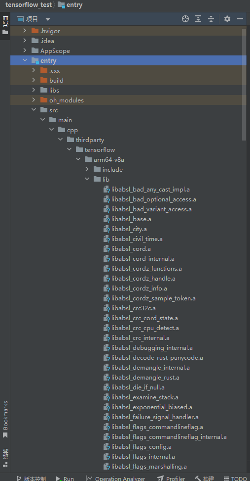
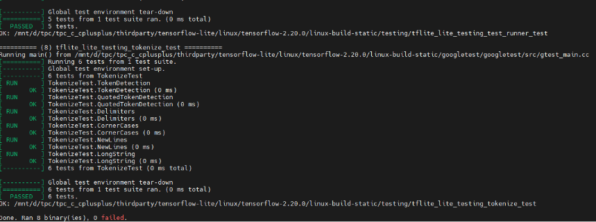

# tensorflow-lite集成到应用hap

本库是在RK3568开发板上基于OpenHarmony3.2 Release版本的镜像验证的，如果是从未使用过RK3568，可以先查看[润和RK3568开发板标准系统快速上手](https://gitee.com/openharmony-sig/knowledge_demo_temp/tree/master/docs/rk3568_helloworld)。

## 开发环境
- [开发环境准备](../../../docs/hap_integrate_environment.md)

## 编译三方库

- 下载本仓库

  ```shell
  git clone https://gitee.com/openharmony-sig/tpc_c_cplusplus.git --depth=1
  ```

- 三方库目录结构

  ```shell
  tpc_c_cplusplus/thirdparty/tensorflow-lite   #三方库tensorflow-lite的目录结构
  ├── docs                                     #三方库相关文档的文件夹
  ├── HPKBUILD                                 #构建脚本
  ├── HPKCHECK                                 #自动化测试脚本
  ├── SHA512SUM                                #三方库校验文件
  ├── README.OpenSource                        #说明三方库源码的下载地址，版本，license等信息
  ├── README_zh.md   
  ```
  
- 在lycium目录下编译三方库
  编译环境的搭建参考[准备三方库构建环境](../../../lycium/README.md#1编译环境准备)
  
  ```shell
  cd lycium
  ./build.sh tensorflow-lite
  ```

- 三方库头文件及生成的库

- 在lycium目录下会生成usr目录，该目录下存在已编译完成的32位和64位三方库

 &nbsp;

  
- [测试三方库](#测试三方库)

## 应用中使用三方库

- 在IDE的cpp目录下新增thirdparty目录，将编译生成的库头文件拷贝到该目录下, 如下图所示

 &nbsp;


- 在最外层（cpp目录下）CMakeLists.txt中添加如下语句
 ```cmake
  set(CMAKE_SHARED_LINKER_FLAGS "${CMAKE_SHARED_LINKER_FLAGS} -Wl,--whole-archive")
  set(CMAKE_EXE_LINKER_FLAGS "${CMAKE_EXE_LINKER_FLAGS} -Wl,--whole-archive")

  file(GLOB_RECURSE ABSL_LIBS "${CMAKE_CURRENT_SOURCE_DIR}/thirdparty/tensorflow/${OHOS_ARCH}/lib/libabsl_*.a")
  target_link_libraries(entry PRIVATE ${ABSL_LIBS})

  file(GLOB_RECURSE RUY_LIBS "${CMAKE_CURRENT_SOURCE_DIR}/thirdparty/tensorflow/${OHOS_ARCH}/lib/libruy_*.a")
  target_link_libraries(entry PRIVATE ${RUY_LIBS})

  target_link_libraries(entry PRIVATE
  ${CMAKE_CURRENT_SOURCE_DIR}/thirdparty/tensorflow/${OHOS_ARCH}/lib/libcpuinfo.a
  ${CMAKE_CURRENT_SOURCE_DIR}/thirdparty/tensorflow/${OHOS_ARCH}/lib/libeight_bit_int_gemm.a
  ${CMAKE_CURRENT_SOURCE_DIR}/thirdparty/tensorflow/${OHOS_ARCH}/lib/libfarmhash.a
  ${CMAKE_CURRENT_SOURCE_DIR}/thirdparty/tensorflow/${OHOS_ARCH}/lib/libfft2d_fftsg.a
  ${CMAKE_CURRENT_SOURCE_DIR}/thirdparty/tensorflow/${OHOS_ARCH}/lib/libfft2d_fftsg2d.a
  -Wl,--whole-archive
  ${CMAKE_CURRENT_SOURCE_DIR}/thirdparty/tensorflow/${OHOS_ARCH}/lib/libflatbuffers.a
  -Wl,--no-whole-archive
  ${CMAKE_CURRENT_SOURCE_DIR}/thirdparty/tensorflow/${OHOS_ARCH}/lib/libkleidiai.a
  ${CMAKE_CURRENT_SOURCE_DIR}/thirdparty/tensorflow/${OHOS_ARCH}/lib/libpthreadpool.a
  ${CMAKE_CURRENT_SOURCE_DIR}/thirdparty/tensorflow/${OHOS_ARCH}/lib/libtensorflow-lite.a
  ${CMAKE_CURRENT_SOURCE_DIR}/thirdparty/tensorflow/${OHOS_ARCH}/lib/libXNNPACK.a
  ${CMAKE_CURRENT_SOURCE_DIR}/thirdparty/tensorflow/${OHOS_ARCH}/lib/libxnnpack-delegate.a
  ${CMAKE_CURRENT_SOURCE_DIR}/thirdparty/tensorflow/${OHOS_ARCH}/lib/libxnnpack-microkernels-prod.a)
  target_include_directories(entry PRIVATE ${CMAKE_CURRENT_SOURCE_DIR}/thirdparty/tensorflow/${OHOS_ARCH}/include)
```

## 测试三方库
## 测试三方库

- 编译出可执行的文件进行测试，[准备三方库测试环境](../../../lycium/README.md#3ci环境准备)

- 进入到构建目录运行测试用例（注意arm64-v8a-build为构建64位的目录，armeabi-v7a-build为构建32位的目录），执行结果如图所示
```
  cd /data/tpc_c_cplusplus/thirdparty/tensorflow-2.20.0/arm64-v8a-build/testing/
  ./tflite_lite_testing_matchers_test
  ./tflite_lite_testing_message_test
  ./tflite_lite_testing_split_test
  ./tflite_lite_testing_join_test
  ./tflite_lite_testing_tokenize_test
  ./tflite_lite_testing_test_runner_test
  ./tflite_lite_testing_input_generator_test
  ./tflite_lite_testing_diff_analyzer_test

```
&nbsp;

## 参考资料
- [润和RK3568开发板标准系统快速上手](https://gitee.com/openharmony-sig/knowledge_demo_temp/tree/master/docs/rk3568_helloworld)
- [OpenHarmony三方库地址](https://gitee.com/openharmony-tpc)
- [OpenHarmony知识体系](https://gitee.com/openharmony-sig/knowledge)
- [通过DevEco Studio开发一个NAPI工程](https://gitee.com/openharmony-sig/knowledge_demo_temp/blob/master/docs/napi_study/docs/hello_napi.md)
