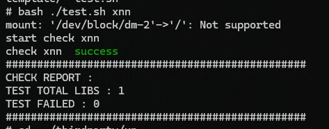

# xnn集成到应用hap
本库是在RK3568开发板上基于OpenHarmony3.2 Release版本的镜像验证的，如果是从未使用过RK3568，可以先查看[润和RK3568开发板标准系统快速上手](https://gitee.com/openharmony-sig/knowledge_demo_temp/tree/master/docs/rk3568_helloworld)。
## 开发环境
- [开发环境准备](../../../docs/hap_integrate_environment.md)
## 编译三方库
- 下载本仓库
  ```
  git clone https://gitcode.com/CPF-ApplicationTPC/tpc_c_cplusplus.git --depth=1
  ```
  
- 三方库目录结构
  ```
  tpc_c_cplusplus/thirdparty/xnn   # 三方库xnn的目录结构如下
  ├── docs                                     # 三方库相关文档的文件夹
  ├── HPKBUILD                                 # 构建脚本
  ├── HPKCHECK                                 # 测试脚本
  ├── README.OpenSource                        # 说明三方库源码的下载地址，版本，license等信息
  ├── README_zh.md                             # 三方库说明文档
  ```
  
- 在lycium目录下编译三方库
  编译环境的搭建参考[准备三方库构建环境](../../../lycium/README.md#1编译环境准备)
  ```
  cd lycium
  ./build.sh xnn
  ```
  
- 三方库头文件及生成的库
  在lycium目录下会生成usr目录，该目录下存在已编译完成的32位和64位三方库
  
  ```
  xnn/arm64-v8a   xnn/armeabi-v7a
  ```

- [测试三方库](#测试三方库)

## 应用中使用三方库
- 在IDE的cpp目录下新增thirdparty目录

xnn 编译后生成静态库 libxnn.a 和头文件 xnn.h，但它链接了 Caffe、MXNet、OpenCV 等多个底层库，因此集成时需要将所有依赖的静态库和对应头文件一同引入工程。

### 拷贝文件
在 IDE 的 entry/src/main/cpp/thirdparty 下新建 xnn 目录，内部结构如下：

  ```
thirdparty/xnn/
├── include/
│   └── xnn.h             
├── lib/
│   └── libxnn.a               
└── deps/                      
    ├── caffe/
    ├── mxnet/
    ├── boost/
    ├── opencv/
    ├── protobuf/
    ├── OpenBLAS/
    ├── fmt/
    ├── spdlog/
    ├── glog/
    ├── gflags/
    ├── picpac/
    ├── TH/
    ├── luaT/
    ├── LuaJIT/
    ├── json11-1.0.0/
    ├── hdf5/
    ├── leveldb/
    ├── snappy/
    ├── zlib/
    ├── szip/
    └── openmp/
  ```
### 设置三方库根路径  
set(XNN_ROOT ${CMAKE_CURRENT_SOURCE_DIR}/thirdparty/xnn)
set(XNN_DEPS ${XNN_ROOT}/deps)

### 头文件路径
include_directories(${XNN_ROOT}/include)
include_directories(${XNN_DEPS}/caffe/include)
include_directories(${XNN_DEPS}/mxnet/include)
include_directories(${XNN_DEPS}/boost/include)
include_directories(${XNN_DEPS}/opencv/include/opencv4)
include_directories(${XNN_DEPS}/protobuf/include)
include_directories(${XNN_DEPS}/OpenBLAS/include)
include_directories(${XNN_DEPS}/fmt/include)
include_directories(${XNN_DEPS}/spdlog/include)
include_directories(${XNN_DEPS}/glog/include)
include_directories(${XNN_DEPS}/gflags/include)
include_directories(${XNN_DEPS}/picpac/include)
include_directories(${XNN_DEPS}/TH/include)
include_directories(${XNN_DEPS}/luaT/include)
include_directories(${XNN_DEPS}/LuaJIT/include)
include_directories(${XNN_DEPS}/json11-1.0.0/include)
include_directories(${XNN_DEPS}/hdf5/include)
include_directories(${XNN_DEPS}/leveldb/include)
include_directories(${XNN_DEPS}/snappy/include)
include_directories(${XNN_DEPS}/zlib/include)

### 声明所有静态库的 IMPORTED 目标（可选，直接 link 静态库文件也支持）
add_library(xnn STATIC IMPORTED)
set_target_properties(xnn PROPERTIES IMPORTED_LOCATION ${XNN_ROOT}/lib/libxnn.a)

# 引入依赖库（按链接顺序）
target_link_libraries(entry PRIVATE
    xnn
    ${XNN_DEPS}/mxnet/lib/libmxnet.a
    ${XNN_DEPS}/caffe/lib/libcaffe.a
    ${XNN_DEPS}/picpac/lib/libpicpac.a
    ${XNN_DEPS}/protobuf/lib/libprotobuf.a
    ${XNN_DEPS}/opencv/lib/libopencv_core.a
    ${XNN_DEPS}/opencv/lib/libopencv_imgproc.a
    ${XNN_DEPS}/opencv/lib/libopencv_imgcodecs.a
    ${XNN_DEPS}/boost/lib/libboost_system.a
    ${XNN_DEPS}/boost/lib/libboost_filesystem.a
    ${XNN_DEPS}/fmt/lib/libfmt.a
    ${XNN_DEPS}/spdlog/lib/libspdlog.a
    ${XNN_DEPS}/glog/lib/libglog.a
    ${XNN_DEPS}/gflags/lib/libgflags.a
    ${XNN_DEPS}/OpenBLAS/lib/libopenblas.a
    ${XNN_DEPS}/TH/lib/libTH.a
    ${XNN_DEPS}/luaT/lib/libluaT.a
    ${XNN_DEPS}/LuaJIT/lib/libluajit.a
    ${XNN_DEPS}/json11-1.0.0/lib/libjson11.a
    ${XNN_DEPS}/hdf5/lib/libhdf5.a
    ${XNN_DEPS}/hdf5/lib/libhdf5_hl.a
    ${XNN_DEPS}/leveldb/lib/libleveldb.a
    ${XNN_DEPS}/snappy/lib/libsnappy.a
    ${XNN_DEPS}/zlib/lib/libz.a
    ${XNN_DEPS}/szip/lib/libszip.a
    ${XNN_DEPS}/openmp/lib/libopenmp.a
    # 系统库
    m
    dl
    c++_shared
)

# 链接系统数学库和动态加载库，以及 C++ 标准库
target_link_libraries(entry PRIVATE m dl c++_shared)

- 权限配置
  无

## 测试三方库
三方库的测试使用原库提供的测试用例来做测试，[准备三方库测试环境](../../../lycium/README.md#3ci环境准备)

进入到构建目录执行指令 运行测试用例（arm64-v8a-build为构建64位的目录，armeabi-v7a-build为构建32位的目录）

### 进入目录，推送到板子
hdc file send D:\archive\xnn\data /data/local/tmp/xnn/archive/xnn/data
hdc file send D:\archive\xnn\model /data/local/tmp/xnn/archive/xnn/model

### 进入板子并执行测试， 设置库路径
cd /data/local/tmp/xnn/armeabi-v7a-build
chmod +x predict xnn-roc
export LD_LIBRARY_PATH=""
for d in /data/local/tmp/xnn/*/armeabi-v7a/lib; do
    LD_LIBRARY_PATH="$d:$LD_LIBRARY_PATH"
done
LD_LIBRARY_PATH="/system/lib:$LD_LIBRARY_PATH"

### 运行 predict
./predict /data/local/tmp/xnn/archive/xnn/model /data/local/tmp/xnn/archive/xnn/data/face.png --mode 0

### 运行 xnn-roc（如果 data 中有 test.piapac 或 ddd）
./xnn-roc --model /data/local/tmp/xnn/archive/xnn/model --db /data/local/tmp/xnn/archive/xnn/data/test.piapac --split_negate 0 --annotate none

 


## 参考资料
- [润和RK3568开发板标准系统快速上手](https://gitee.com/openharmony-sig/knowledge_demo_temp/tree/master/docs/rk3568_helloworld)
- [OpenHarmony三方库地址](https://gitee.com/openharmony-tpc)
- [OpenHarmony知识体系](https://gitee.com/openharmony-sig/knowledge)
- [通过DevEco Studio开发一个NAPI工程](https://gitee.com/openharmony-sig/knowledge_demo_temp/blob/master/docs/napi_study/docs/hello_napi.md)
