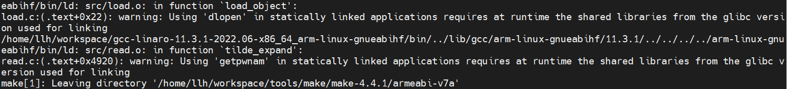

# make 工具armeabi-v7a交叉编译说明

## 简介
GNUMake是一种工具，用于控制从程序的源文件生成程序的可执行文件和其他非源文件。

## 编译步骤

### 编译工具链下载

- 32位编译工具：gcc-linaro-11.3.1-2022.06-x86_64_arm-linux-gnueabihf.tar.xz [下载链接](https://snapshots.linaro.org/gnu-toolchain/11.3-2022.06-1/arm-linux-gnueabihf/gcc-linaro-11.3.1-2022.06-x86_64_arm-linux-gnueabihf.tar.xz)

### 解压编译工具链

- 解压32位 gcc-linaro-11.3.1-2022.06-x86_64_arm-linux-gnueabihf.tar.xz


- 进入解压后的文件夹，查看bin目录下就有我们编译用到的工具链

### 下载解压make源码

- 下载最新版本的make源码 https://ftp.gnu.org/gnu/make/make-4.4.1.tar.gz (以4.4.1为例)
- 通过tar命令解压源码 tar -xzvf make-4.4.1.tar.gz

### 创建编译目录

- 进入源码解压后目录 cd make-4.4.1

- 创建32位为 mkdir armeabi_v7a

### 设置交叉编译环境

- 设置32位交叉编译环境, xxx 是表示工具链存放的目录路径

```shell
export TOOLS=/xxx/gcc-linaro-11.3.1-2022.06-x86_64_arm-linux-gnueabihf/bin
export AS=${TOOLS}/arm-linux-gnueabihf-as
export CC=${TOOLS}/arm-linux-gnueabihf-gcc
export CXX=${TOOLS}/arm-linux-gnueabihf-g++
export LD=${TOOLS}/arm-linux-gnueabihf-ld
export STRIP=${TOOLS}/arm-linux-gnueabihf-strip
export RANLIB=${TOOLS}/arm-linux-gnueabihf-ranlib
export OBJDUMP=${TOOLS}/arm-linux-gnueabihf-objdump
export OBJCOPY=${TOOLS}/arm-linux-gnueabihf-objcopy
export NM=${TOOLS}/arm-linux-gnueabihf-gcc-nm
export AR=${TOOLS}/arm-linux-gnueabihf-ar
```

### 生成makefile

-  进入32位为 cd armeabi_v7a
- 执行如下命令生成makefile

```shell
../configure --host="arm-linux" --prefix="${PWD}/install"
```

### 编译make源码

在对应的编译目录执行make CFLAGS="-static" LDFLAGS="-static" VERBOSE=1，执行结果截图如下

&nbsp;

### 安装make

在对应编译目录执行 make install，执行结果截图如下：

&nbsp;

### 编译安装完成

查看编译目录下的install文件夹，并可通过file bin/make 看到文件属性

&nbsp;

### 运行结果

将编译目录install文件夹压缩打包，发送到OHOS开发板中

```shell
#打包对应编译目录下的install文件夹
tar -zcvf install.tar.gz install/
#发送到OHOS系统开发板上
hdc file send xxx\install.tar.gz /data   
#进入开发板/data，解压install.tar.gz
hdc shell
cd /data
tar -zxvf install.tar.gz
```

进入install/bin目录，执行./make -version 效果如下截图 

&nbsp;
